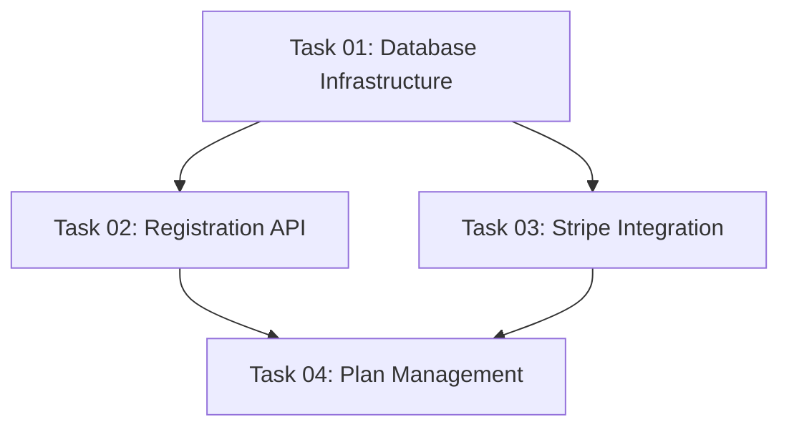

# Task Index File Structure

This document defines the structure for the master task index file that tracks all tasks and their status.

---

## File Location

The index file is created at:
```
docs/tasks/{date}-{feature}-implementation-tasks.md
```

---

## Index File Structure

### Header

```markdown
# Implementation Plan: {Feature Title}

This document tracks the high-level implementation of {Feature} based on the [{requirement-filename}](../requirements/{requirement-filename}).
```

---

## Progress Summary

```markdown
## Progress Summary

- **Total Tasks**: {N}
- **Completed**: {X} / {N} ({percentage}%)
- **Phase 1 (Foundation)**: {status_icon} {completed}/{total}
- **Phase 2 (Backend API & Services)**: {status_icon} {completed}/{total}
- **Phase 3 (Frontend — 3a Data / 3b Components / 3c Integration / 3d Tests)**: {status_icon} {completed}/{total}
- **Phase 4 (Quality & Documentation)**: {status_icon} {completed}/{total}
- **Estimated Total Effort**: {sum of all task efforts}

Where status_icon = ✅ (all done) | 🔄 (in progress) | ⏳ (not started)
```

---

## Task Modules

> [!NOTE]
> Group sections by **build track**, not strictly by phase number. Numbering = recommended execution order; the dependency graph is authoritative. A **backend test task is Phase 4 but belongs under the Backend track right after its API tasks** (it never depends on frontend), so it carries an early number — list it with the backend, not after the Phase 3 frontend block. A `Phase` column in the tables keeps the conceptual phase visible while the section grouping follows the track.

```markdown
## Task Modules

The implementation is divided into {N} modules. Sections are grouped by build track (Backend, Frontend, Documentation); numbering follows recommended execution order.

### Phase 1: Foundation

| # | Task Module | Type | Effort | Link | Status |
| :--- | :--- | :--- | :--- | :--- | :--- |
| 1 | **{Title}** | IMPL | M | [Task 01]({relative-path}) | ⏳ Pending |

### Phase 2: Backend API & Services

| # | Task Module | Type | Effort | Link | Status |
| :--- | :--- | :--- | :--- | :--- | :--- |
| 2 | **{Title}** | IMPL | L | [Task 02]({relative-path}) | ⏳ Pending |
| 10 | **{Cross-cutting Title}** | COORD | S | [Task 10]({relative-path}) | ⏳ Pending |

### Phase 3: Frontend

Split by **Screen × Layer** (3a Data / 3b Components / 3c Integration / 3d Tests). Every FE task must be S/M effort — no L/XL (see Frontend Task Decomposition Strategy).

| # | Task Module | Type | Effort | Link | Status |
| :--- | :--- | :--- | :--- | :--- | :--- |
| 5 | **3a — {Screen} Data Layer** | IMPL | S | [Task 05]({relative-path}) | ⏳ Pending |
| 6 | **3b — {Screen} Components** | IMPL | M | [Task 06]({relative-path}) | ⏳ Pending |
| 7 | **3c — {Screen} Page Integration** | IMPL | M | [Task 07]({relative-path}) | ⏳ Pending |

### Phase 4: Quality & Documentation

| # | Task Module | Type | Effort | Link | Status |
| :--- | :--- | :--- | :--- | :--- | :--- |
| 8 | **{Title}** | DOC | S | [Task 08]({relative-path}) | ⏳ Pending |
```

**Status icons:**
- `⏳ Pending` — Not started.
- `🔄 In Progress` — Currently being implemented.
- `✅ Completed` — Done and verified.

---

## Dependency Graph

```markdown
## Dependency Graph


```

**Rules:**
- Use Mermaid `graph TD` (top-down) format.
- Node IDs should match task numbers (e.g., `T01`, `T02`).
- Label nodes with task number and brief title.
- Arrows indicate dependencies (T01 → T02 means T01 must complete before T02).
- Ensure no circular dependencies.

---

## Execution Order Recommendation

```markdown
## 🚦 Execution Order Recommendation

1. **Task 01: Database Infrastructure** — Foundation must be laid first.
2. **Task 02: Background Jobs** — Required before APIs that dispatch them.
3. **Task 03: Master Data Registration** — Required before APIs that use the data.
4. **Tasks 04, 05** — Can be done in parallel (no inter-dependencies).
5. **Task 06: Frontend** — Depends on all API tasks.
```

---

## Task Lifecycle in Index File

### Status Transitions

Tasks follow this lifecycle: `pending` → `in_progress` → `completed`.

1. **Starting a task**: Update BOTH the task file's YAML frontmatter (`status: in_progress`) and the index file table (`🔄 In Progress`).
2. **Completing a task**: Update BOTH the task file's YAML frontmatter (`status: completed`) and the index file table (`✅ Completed`). Also update the Progress Summary counts.
3. **Cross-task Delegation Updates**: When completing an IMPLEMENTATION task that fulfills a delegated requirement from a COORDINATION task, you MUST open the COORDINATION task file and update the status in its Delegation Map to `✅ Completed`.

---

## Index File Maintenance

### When to Update

1. **Task Status Changes**: When any task moves from pending → in_progress or in_progress → completed.
2. **New Tasks Added**: When adding tasks after initial creation.
3. **Task Dependencies Change**: When modifying the dependency graph.

### Update Checklist

- [ ] Update task status in the Phase table
- [ ] Update Progress Summary counts
- [ ] Update Mermaid dependency graph if dependencies changed
- [ ] Update execution order recommendation if needed
