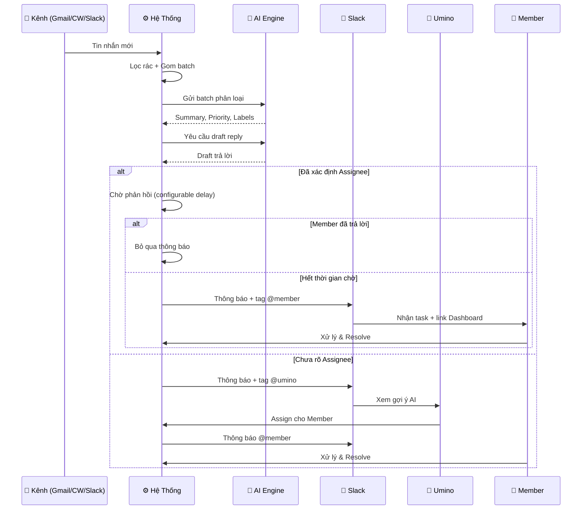

# Communication Hub PoC — Kiến Trúc

## 1. Tuyên Bố Vấn Đề

Tập trung tin nhắn từ Gmail, Chatwork và Slack; sử dụng AI tóm tắt và phân loại, sau đó tự động chia việc vào nhóm chung trên Slack (tag member phụ trách). Nếu không thể tự chia, hệ thống sẽ thông báo cho Umino quyết định.

## 2. Tổng Quan Kiến Trúc

### 2.1 Kiến Trúc Hệ Thống Tổng Quan

[Xem Biểu Đồ Kiến Trúc Hệ Thống (SVG/HTML)](./diagrams/architecture-diagram.vi.html)

### 2.2 Luồng Xử Lý Tin Nhắn (Message Pipeline)

[Xem Biểu Đồ Luồng Xử Lý Tin Nhắn (SVG/HTML)](./diagrams/message-pipeline.vi.html)

### 2.3 Luồng Thông Báo & Phân Công



## 3. Luồng Hoạt Động (Luồng Tin Nhắn)

### 3.1 Luồng Phân Loại Tin Nhắn

**1. Tiếp Nhận Tin Nhắn**
- Nhận tin nhắn qua Webhook hoặc Polling từ Gmail/Chatwork/Slack.
- Thu thập cả tin đến (inbound) và tin gửi đi (outbound).
- File đính kèm: Chỉ lưu metadata, bỏ qua nội dung file.

**2. Xác Định Người Gửi & Phân Biệt Tin Đến / Tin Đi**
- **Bước 2a — Xác định người gửi (Sender Identification):**
  - Mỗi tin nhắn đều cần xác định **ai là người gửi** trước khi phân loại Inbound/Outbound.
  - **Cách nhận biết theo kênh:**
    - *Gmail:* Lấy `From` header → So sánh với danh sách email nội bộ (bảng `users.email`).
    - *Chatwork:* Lấy `account_id` → So sánh với `users.chatwork_id`.
    - *Slack:* Lấy `user_id` → So sánh với `users.slack_id`.
  - **Kết quả:**
    - Match nội bộ → `message.sender_type = 'internal'`, gắn `message.sender_user_id` (FK → `users`). Đây là tin **Outbound**.
    - Không match → `message.sender_type = 'external'`, `sender_user_id = NULL`. Đây là tin **Inbound**. Người gửi cụ thể sẽ được xác định ở Bước 4 (Person Dedup → `client_contact_id`).
- **Bước 2b — Phân luồng xử lý theo direction:**
  - **Tin đến (Inbound):** Tin nhắn từ khách hàng/người ngoài gửi vào → Đi tiếp toàn bộ luồng xử lý (lọc rác → batch → AI phân loại → thông báo).
  - **Tin đi (Outbound):** Tin nhắn do nội bộ công ty gửi ra → Đi qua cơ chế Batching và **AI phân loại** để bổ sung ngữ cảnh hội thoại (thread context), gắn nhãn `answer`/`info`/`chit_chat` cho AI biết khách hàng đã được trả lời chưa. **Không tạo thông báo, không gán việc.**
  - **Tại sao cần `sender_user_id` cho Outbound:** Job 7 (CheckAssigneeResponse) cần biết chính xác **ai** trong nội bộ đã trả lời để so sánh với assignee hiện tại.

**3. Tiền Xử Lý Kênh (Cơ Chế Batching)** *(Áp dụng cho cả Inbound và Outbound)*
- **Lọc rác (chỉ Inbound):** Loại bỏ spam, newsletter, tin nhắn marketing. Outbound bỏ qua bước lọc này.
- **Phân loại Create/Update:**
  - Create: Tiếp tục luồng xử lý bình thường.
  - Update (chỉnh sửa tin nhắn Chatwork/Slack): Cập nhật nội dung mới nhất vào DB.
    - Nếu tin nhắn đang chờ gom (`pending_batch`): Giữ nguyên trạng thái (AI sẽ đọc nội dung mới nhất).
    - Nếu tin nhắn đang xử lý (`processing` hoặc đã qua AI): Lưu nội dung mới vào `pending_content`, đánh dấu `has_update = true` + bắn thông báo nhẹ cho Assignee (nếu có) tự đọc lại. Không gọi lại AI để tránh vòng lặp (loop). Khi AI xong → Kiểm tra flag → Nếu có update → Dùng `pending_content` làm nội dung mới → Dispatch job re-classify chỉ tin bị sửa.
    - **Cơ chế Lock:** Khi batch bắt đầu xử lý (status `processing`) → Lock messages trong batch (dùng DB `SELECT FOR UPDATE`). Tin nhắn update đến khi đang `processing` → Không ghi đè, chỉ đánh dấu `has_update`. Sau khi AI xong → Kiểm tra flag → Nếu có update → Dispatch job re-classify chỉ tin bị sửa.
    - **Cơ chế Heartbeat:** Job xử lý message cập nhật `processing_heartbeat_at` định kỳ. Cron job 5 phút/lần kiểm tra các message processing quá 10 phút không heartbeat → chuyển sang `error_retryable`.
- **Gom Batch Tin Nhắn (Debouncing):**
  - Tin nhắn mới được gắn trạng thái `pending_batch`.
  - Khởi tạo Delayed Job với token unique (thời gian chờ cấu hình qua `system_settings.batch_debounce_delay`, mặc định: 15 phút).
  - **Cơ chế Reset Timer (Soft Cancel):** Tin nhắn mới trong cùng Thread/Room → Đánh dấu token cũ là `cancelled` trong Redis, dispatch job mới với token mới. Job cũ khi chạy kiểm tra token → bỏ qua nếu đã bị cancel.
  - **Giới hạn Batch:** Tối đa `system_settings.batch_max_wait` (mặc định: 30 phút) hoặc `system_settings.batch_max_messages` (mặc định: 20 tin) — tùy điều kiện nào đến trước.
  - Hết thời gian chờ (người dùng ngừng chat): Gom toàn bộ tin nhắn chưa xử lý thành 1 batch → Dispatch `ProcessBatch` job.
  - **Sub-grouping theo Thread trong Batch:** Sau khi gom batch, trước khi gửi AI → nhóm tin nhắn theo thread:
    - Tin nhắn đã xác định thread (có `reply_to`/`thread_ts`/`threadId` match DB) → Nhóm vào `known_thread_groups[thread_id]`.
    - Tin nhắn chưa rõ thread → Nhóm vào `unassigned_group`.
    - Cấu trúc batch gửi AI: `{ known_threads: [{thread_id, messages, thread_context}], unassigned: [messages] }`.
    - AI xử lý từng nhóm thread với context riêng → tăng độ chính xác phân loại.

**4. Xác Định Khách Hàng & Project (Ưu Tiên Rules)**
- **Dựa vào Context kênh (Không cần AI):**
  - *Slack:* Dùng `team`, `channel`, `thread_ts` và `user_id`.
  - *Chatwork:* Dựa vào `room_id` hoặc `chatwork_id` của người gửi.
  - *Gmail:* Lấy email người gửi từ `From` header.
- **Reply Chain Lookup (Truy ngược từ tin nhắn reply):**
  - Nếu tin nhắn là reply (có `reply_to` / `thread_ts` / `threadId`) → Tìm tin nhắn gốc trong DB (dựa vào `external_id`).
  - Nếu tin gốc đã được phân loại → **Gọi AI validate reply relevance** (xem chi tiết dưới đây).
  - Áp dụng cho cả Inbound và Outbound (outbound reply cũng kế thừa context).
  - *Chi tiết theo kênh:*
    - *Chatwork:* Dùng trường `reply_to` (message_id của tin gốc) → Tìm trong DB.
    - *Gmail:* Dùng `threadId` + `In-Reply-To` / `References` header → Tìm message gốc trong thread.
    - *Slack:* Dùng `thread_ts` → Tìm parent message trong DB.
- **AI Validate Reply Relevance (Kiểm tra reply có đúng chủ đề):**
  - Input cho AI: Nội dung tin nhắn reply + Nội dung tin gốc + Context tin gốc (`project_id`, `thread_id`, `summary`).
  - AI trả về:
    - `is_relevant: true` → Kế thừa `project_id`, `thread_id`, `client_id` từ tin gốc.
    - `is_relevant: false` + lý do → **Bỏ reply chain**, chuyển sang luồng phân loại AI thường (như tin nhắn mới hoàn toàn).
  - Tại sao cần: Khách hàng có thể reply sai tin (VD: reply vào tin về "Project A" nhưng nội dung hỏi về "Project B" → không nên kế thừa context sai).
  - Ưu tiên: **Rules** > **Reply Chain + AI Validate** > **AI phân loại** > **Thủ công**.
- **Sử Dụng AI (Nếu Rules thất bại, hoặc Reply Chain bị reject do sai chủ đề):**
  - Cung cấp: 10 tin nhắn gần nhất trong **cùng kênh/room** (để AI hiểu ngữ cảnh hội thoại: ai đang nói, bàn về dự án nào), kèm danh sách khách hàng và active projects.
  - Mapping Khách hàng và Project trong cùng một lượt xử lý.
- **Duyệt Thủ Công:** AI trả về độ tự tin thấp hoặc không chọn được → Lưu nháp và chuyển sang luồng thông báo (gửi Slack chung + tag @umino).

**Person Dedup (Xác Định Người Gửi Cụ Thể):**
- Vấn đề: Cùng 1 công ty khách hàng có nhiều nhân viên liên hệ qua nhiều kênh (VD: Tanaka-san gửi email Gmail, Suzuki-san nhắn qua Chatwork). Cần biết chính xác **ai** gửi, không chỉ công ty nào.
- Mô hình 2 tầng: **Client** (công ty/tổ chức) → có nhiều **Client Contacts** (nhân viên liên hệ). Mỗi contact có external_ids riêng (email, chatwork_id, slack_id).
- Cơ chế resolve (ưu tiên cao → thấp):
  1. Match `client_contact_external_ids` theo external_id (email, chatwork_id, slack_id) → tìm ra `client_contact_id` → suy ra `client_id` qua relation.
  2. Match `client_external_ids` (cấp công ty — VD: chatwork room_id map cả công ty) → tìm ra `client_id`, nhưng `client_contact_id` vẫn là NULL.
  3. Không match → Tạo client mới + contact mới → Umino có thể merge sau qua Dashboard.
- Kết quả: `message.client_contact_id` = người gửi cụ thể, `message.client_id` = công ty. Nếu chưa xác định được người gửi → `client_contact_id = NULL`, `client_id` vẫn có thể xác định được qua rule-based.

**5. Chọn Thread (Ưu Tiên Rules)**
- **Dựa vào Context kênh (kèm Reply Chain):**
  - *Gmail:* ID lấy từ `threadId` của API. Nếu là reply → `In-Reply-To` header chỉ tin gốc → Kế thừa `thread_id` từ tin gốc trong DB.
  - *Slack:* ID từ `thread_ts`. Nếu có `thread_ts` → Tìm parent message trong DB → Kế thừa `thread_id`.
  - *Chatwork:* ID từ `reply_to`. Nếu có `reply_to` → Tìm tin gốc trong DB → Kế thừa `thread_id`.
  - **Lưu ý:** Nếu Bước 4 đã reject reply chain (AI xác nhận reply sai chủ đề) → Bỏ qua bước này, thread sẽ được AI chọn hoặc tạo mới.
- **Sử Dụng AI (Nếu Rules thất bại — tin nhắn mới hoàn toàn hoặc reply chain bị reject):**
  - Cung cấp: Context tin nhắn hiện tại và danh sách active threads **thuộc project đã xác định ở Bước 4** (giới hạn phạm vi, tránh AI chọn nhầm thread của project khác).
  - Trả về: Chọn thread cụ thể. Nếu AI không chọn được → Lưu nháp và chuyển sang luồng thông báo (gửi Slack chung + tag @umino).

**6. AI Phân Loại Nội Dung (Xử Lý Batch — Có Sub-grouping Theo Thread)**
- **Cấu trúc Input:** Batch được chia thành các nhóm thread trước khi gửi AI (xem Bước 3):
  - `known_threads`: Danh sách nhóm tin đã xác định thread → Mỗi nhóm kèm `thread_summary` (lấy record mới nhất từ bảng `thread_summaries`) + 10 tin gần nhất trong thread đó.
  - `unassigned`: Tin nhắn chưa rõ thread → Kèm 10 tin gần nhất trong **room/channel** + danh sách active threads để AI chọn.
- **Gửi 1 lần AI call cho toàn batch** (POC — đơn giản, tiết kiệm cost): AI nhận toàn bộ batch với cấu trúc sub-group → xử lý từng nhóm thread với context tương ứng → trả kết quả theo nhóm.
- **Output Cấp Nhóm Thread (per thread group):**
  - `summary`: Tóm tắt đợt chat trong thread.
  - `priority`: Mức độ ưu tiên (high/medium/low).
  - `project_knowledge_updates`: Thông tin quan trọng cần lưu trữ.
  - `suggested_assignee`: Đề xuất người phụ trách (nếu có).
  - `suggested_action`: trả lời ngay / chờ thêm info / assign cho member.
  - `client_contact_id`: Gợi ý người gửi cụ thể — **chỉ dùng khi Person Dedup (Bước 4) trả về `NULL`**. Nếu Person Dedup đã resolve thành công → bỏ qua giá trị này.
- **Output Cấp Tin Nhắn:**
  - Gắn nhãn chi tiết (label): `new_request`, `answer`, `info`, `chit_chat`, `action_confirmation`.
  - Với `unassigned` messages: AI trả thêm `assigned_thread_id` (thread hiện có hoặc `null` → tạo mới).

**7. Lưu Cập Nhật Ngữ Cảnh Dự Án**
- Có `project_knowledge_updates` → Lưu nháp vào DB. Cron job định kỳ sẽ tổng hợp sau.

**8. Xác Định Người Phụ Trách (Assignee)**
- Thread đã có assignee → Giữ nguyên.
- Thread chưa có assignee → Gán `suggested_assignee`.
- Chưa xác định được → Chuyển sang luồng thông báo (gửi Slack chung + tag @umino). *Lưu ý: Tối đa 1 assignee / thread.*

**9. AI Tự Động Viết Draft (Auto Generate Draft)**
- Chạy tự động trong pipeline, **sau** AI phân loại và **trước** khi dispatch thông báo.
- Input: Thread context + Project context + Client info + Classification results.
- Gọi AI sinh `draft_reply` → Lưu vào `message.draft_reply` của **tin nhắn cuối cùng (latest)** trong thread group.
- Nếu AI fail → Vẫn dispatch notification nhưng kèm flag `draft_available = false`.
- Draft phải hoàn tất **trước** khi dispatch thông báo, để người nhận có ngay nội dung tham khảo.

**10. Quyết Định Thông Báo & Ghi Nhận Công Việc**
- Nhãn `action_confirmation` → Tự động tạo Task với `deadline = now() + system_settings.task_sla_deadline` (mặc định: 30 phút từ lúc tạo task).
- Batch chỉ chứa nhãn `chit_chat` → Lưu DB, không thông báo.
- **Chiến lược Notify:**
  - *Rõ Assignee:* Ghi `notification_dispatched_at = now()` → Dispatch `CheckAssigneeResponse` (delayed job, delay = `system_settings.check_response_delay`). Khi job chạy → Kiểm tra DB xem assignee (`sender_user_id = assignee.user_id`) đã trả lời trong thread **sau** `notification_dispatched_at` chưa. Đã trả lời → Bỏ qua. Chưa trả lời → Dispatch `NotifyMember`. Đổi trạng thái message sang `notified`. **Song song:** Tạo Task record → Deadline bắt đầu đếm từ lúc task assign.
  - *Chưa rõ Assignee:* Thông báo Slack chung + tag Umino phân xử.
  - **Escalation:** Nhắc lại mỗi `system_settings.reminder_interval`, tối đa `system_settings.max_reminders` lần → Vượt quá → Escalate lên `system_settings.escalation_target`.

**11. Dispatch Notification**
- Format Slack message gửi vào `#task-routing`: **Người gửi** (tên nhân viên liên hệ + công ty), Project, Priority, Thread context, **Draft reply** (nếu `draft_available = true`; nếu `false` → hiển thị "⚠️ Chưa có draft gợi ý, vui lòng tự soạn phản hồi"), **Link chi tiết Task/Message trên Dashboard** và **Link gốc tin nhắn/email trên kênh nguồn** (Chatwork room URL, Gmail web URL, Slack permalink). Tag `@member` hoặc `@umino`.

### 3.2 Ngữ Cảnh Dự Án — Cấu Trúc & Cập Nhật

**Cấu trúc dữ liệu:**
Dữ liệu Project được chia làm 2 phần độc lập:
1. `core_brief` (Thông tin tĩnh): Do Admin nhập ban đầu (brief, requirements, timeline, stakeholders). AI KHÔNG được phép tự ghi đè.
2. `synthesized_knowledge` (Kiến thức động): Do AI tự động chắt lọc từ chat, phân loại theo nhóm (decisions, changes, issues, notes, other).

**Cơ chế cập nhật theo thời gian:**
1. **[Initial]** User tạo project → Nhập `core_brief` ban đầu.
2. **[Auto]** Luồng tin nhắn có `project_knowledge_updates`:
   - Lưu nháp vào bảng `project_knowledge_updates` (Không cập nhật trực tiếp để tránh làm rối ngữ cảnh).
3. **[Job]** Tổng hợp định kỳ (Nightly/Cron):
   - Input cho AI: `core_brief` + `synthesized_knowledge` (cũ) + Danh sách `pending_updates`.
   - Nhiệm vụ AI: Sắp xếp update vào các mục thích hợp, loại bỏ thông tin nhiễu hoặc bị phủ định.
   - Output: `synthesized_knowledge` MỚI.
4. **[History]** Lưu snapshot bản cũ vào `project_knowledge_history` để tra cứu nếu cần.

### 3.3 AI Tự Động Viết Draft Trả Lời — Đầu Vào Ngữ Cảnh

**Prompt AI khi tạo draft reply (chạy ngay sau khi phân loại):**

**Thread Context:**
- Gửi `thread_summary` (lấy record mới nhất từ bảng `thread_summaries`, xem Job 13) **và** 10 tin nhắn gần nhất trong thread `[{sender, content, time}, ...]`.
- **Lưu ý về overlap:** 10 tin gần nhất có thể đã nằm trong `thread_summary` → Đây là cố ý. AI cần đọc nội dung chi tiết của tin gần nhất để viết draft chính xác, trong khi `thread_summary` cung cấp bối cảnh tổng quan. AI được hướng dẫn ưu tiên nội dung chi tiết từ 10 tin nếu có sự trùng lặp.

**Project & Client & Contact Context:**
- Ngữ cảnh dự án: Lấy `core_brief` + `synthesized_knowledge` mới nhất.
- Tin nhắn hiện tại: `content`, `sender_name`, `channel_type`.
- Thông tin khách hàng (công ty): Lấy từ bảng `clients` (`display_name`).
- Thông tin người liên hệ (người gửi cụ thể): Lấy từ bảng `client_contacts` (`display_name`, `role`) nếu có `client_contact_id`.

**Output JSON:**
```json
{
  "draft_reply": "Câu trả lời gợi ý (tiếng Nhật)",
  "confidence": "high | medium | low",
  "suggested_action": "trả lời ngay | chờ thêm info | assign cho member"
}
```

### 3.4 Cơ Chế Tóm Tắt Thread (Rolling Summary)

**Mục đích:** Giảm context window cho AI bằng cách cô đọng lịch sử thread thành bản tóm tắt, thay vì gửi toàn bộ tin nhắn cũ.

**Trigger:** Khi thread có thêm **10 tin nhắn** chưa tóm tắt (so với `last_summarized_message_id`).

**AI Prompt khi tóm tắt:**

**Input:**
- `thread_summary` gần nhất (nếu có — lần đầu sẽ trống).
- Danh sách tin nhắn chưa tóm tắt `[{sender, content, time, label}, ...]`.

**Output JSON:**
```json
{
  "thread_summary": "Bản tóm tắt cô đọng bao gồm: chủ đề chính, quyết định quan trọng, câu hỏi chưa trả lời, trạng thái hiện tại.",
  "last_summarized_message_id": 12345
}
```

**Nguyên tắc:**
- **Không mất thông tin quan trọng:** Quyết định, thay đổi, cam kết, deadline phải được giữ lại.
- **Loại bỏ nhiễu:** Chit-chat, lời chào, tin nhắn lặp → chỉ giữ lại nội dung cốt lõi.
- **Ghi rõ sender:** Phân biệt ai nói gì — ghi rõ **tên người liên hệ cụ thể** (từ `client_contacts`) + công ty (từ `clients`) vs nội bộ → AI hiểu vai trò khi đọc summary sau.
- **Cập nhật `last_summarized_message_id`:** Đánh dấu đến đâu đã tóm tắt, lần sau chỉ lấy tin mới từ điểm này.

**Mối quan hệ với Draft Reply (§3.3):**
- Khi AI tạo draft → Luôn lấy `thread_summary` + 10 tin gần nhất.
- 10 tin gần nhất **có thể đã nằm trong** `thread_summary` → Đây là cố ý:
  - `thread_summary`: Bối cảnh tổng quan (cô đọng, có thể từ rất xa).
  - 10 tin gần nhất: Nội dung chi tiết để viết draft chính xác.
- AI được hướng dẫn: Nếu 10 tin gần nhất đã nằm trong summary → Ưu tiên nội dung chi tiết từ 10 tin.

**Ví dụ:**
```
Thread có 35 tin nhắn:
├─ Tin 1-10:  → Job 13 tóm tắt → summary v1
├─ Tin 11-20: → Job 13 tóm tắt (summary v1 + tin 11-20) → summary v2
├─ Tin 21-30: → Job 13 tóm tắt (summary v2 + tin 21-30) → summary v3
├─ Tin 31-35: Chưa đủ 10 tin → chờ tiếp

Draft Reply lúc tin 33:
  Input = summary v3 (tóm tắt 1-30) + 10 tin gần nhất (tin 24-33)
  → Overlap tin 24-30: AI ưu tiên chi tiết từ 10 tin (24-33)
```

### 3.5 Vòng Đời Nhiệm Vụ (Task Lifecycle)

**Mỗi Thread có thể có nhiều Nhiệm vụ (Tasks).** Một cuộc trò chuyện thường cần nhiều bước xử lý khác nhau. Khi AI hoặc Umino quyết định cần xử lý một việc trong thread → Tạo record trong bảng `tasks`. Mỗi task track trạng thái xử lý riêng, độc lập với message status và với nhau.

**Task Status Lifecycle:**
```text
pending → in_progress → done
    ↓
  overdue (khi deadline < now)
```

| Trạng thái | Mô tả |
|------------|--------|
| `pending` | Mới được giao, member chưa bắt đầu |
| `in_progress` | Member đang xử lý |
| `done` | Đã hoàn thành |
| `overdue` | Quá hạn SLA (`task.deadline < now() AND status != 'done'`) — do cron job check |

**Cờ & fields trên Task:**
- `reply_path`: `path_a` (member tự reply khách trực tiếp) hoặc `path_b` (member xử lý → báo kết quả cho Umino → Umino reply khách). Default: `path_a`. Path B khi Umino nhận task và đẩy cho member.
- `deadline`: `task.created_at` + `system_settings.task_sla_deadline` (mặc định: 30 phút).
- `instruction`: Chỉ thị cụ thể từ Umino cho member.

**Reply Path (Path A vs Path B):**
- **Path A (default):** Member nhận task → Tự reply khách hàng trên kênh gốc → Đổi task status `done`.
- **Path B:** Umino nhận tin → Push task cho member kèm `reply_path = path_b` → Member xử lý + điền `result` → Umino nhận kết quả → Umino tự reply khách → Đổi task status `done`.

### 3.6 Quy Trình Xử Lý Thủ Công (UI Dashboard)

1. **Luồng phân công (Umino):** Nhận thông báo Slack → Click link chi tiết Task → Xem ngữ cảnh và gợi ý từ AI → **Giao việc (Assign)** cho một Member cụ thể → Task được tạo với `reply_path` phù hợp (Path A hoặc B).
2. **Luồng thực hiện (Member):** Nhận thông báo Slack (đã được assign) → Xem task + context hội thoại → Thực hiện công việc → Nếu Path A: tự reply khách → Đánh dấu task `done`. Nếu Path B: điền `result` → Umino nhận kết quả → reply khách → Đánh dấu task `done`.

### 3.7 Vòng Đời Trạng Thái Tin Nhắn (Message Status Lifecycle)

```text
Inbound:  new → pending_batch → processing → classified → [draft_pending] → draft_generated → notified → assigned → resolved
                             ↓              ↓                              ↓            ↓
                   error_retryable   error_fatal                    draft_failed  notify_failed
                                                                              ↓
                                                                     notified (retry) / manual_review

Outbound: new → pending_batch → processing → classified → archived
```

| Trạng thái | Mô tả | Chuyển tiếp tiếp theo |
|------------|--------|----------------------|
| `new` | Vừa lấy từ kênh, chưa phân loại | `pending_batch` (nếu Create) hoặc trực tiếp xử lý |
| `pending_batch` | Đang chờ gom batch (debounce timer) | `processing` (khi timer fires) |
| `processing` | AI đang phân loại + map context | `classified` |
| `classified` | AI đã phân loại xong | `draft_pending` hoặc `draft_generated` |
| `draft_pending` | Đã phân loại xong, đang chờ AI sinh draft reply (Job 5 đang xử lý) | `draft_generated` hoặc `draft_failed` |
| `draft_generated` | Draft reply đã có | `notified` |
| `draft_failed` | AI không sinh được draft | `notified` (không có draft) |
| `notified` | Đã gửi thông báo Slack | `assigned` (khi có assignee) |
| `notify_failed` | Gửi thông báo thất bại | `notified` (retry) hoặc `manual_review` |
| `assigned` | Đã có người phụ trách | `resolved` |
| `resolved` | Hoàn tất | — |
| `archived` | Outbound đã phân loại xong, chỉ lưu context (không cần notify/assign) | — |
| `ignored` | Spam/chit_chat, không cần xử lý | — |
| `error_retryable` | Lỗi có thể retry (max 3 lần, exponential backoff + jitter) | `new`, `pending_batch`, hoặc `processing` |
| `error_fatal` | Lỗi nghiêm trọng không retry được | `manual_review` |
| `manual_review` | Cần can thiệp thủ công | — |

**Cờ bổ sung (flags):**
- `has_update = true`: Tin nhắn đã xử lý bị sửa nội dung.
- `draft_available = false`: AI không sinh được draft.
- `is_notified = true`: Đã gửi notification.
- `notification_dispatched_at`: Thời điểm hệ thống dispatch notification — mốc bắt đầu tính delay cho CheckAssigneeResponse.
- `sender_type`: `'internal'` (nội bộ) hoặc `'external'` (khách hàng).
- `sender_user_id`: FK → `users` (chỉ có khi `sender_type = 'internal'`).
- `retry_count`: Số lần đã retry (max 3 cho `error_retryable`, max 5 cho `notify_failed`).
- `processing_heartbeat_at`: Timestamp heartbeat cuối cùng của processing job.
- `tags`: Danh sách tag người dùng bị @mention trong tin nhắn (array → Member).

**Mapping Status cho UI (User-facing):** Người dùng cuối chỉ cần quan tâm các trạng thái đơn giản. Backend status được mapping thành UI status như sau:

| UI Status | Hiển thị cho user | Backend status tương ứng |
|-----------|-------------------|--------------------------|
| `mới` | Tin nhắn mới, chưa xử lý | `new`, `pending_batch`, `processing`, `classified`, `draft_pending`, `draft_generated` |
| `đã_routing` | Đã phân loại, đang chờ assign | `notified` |
| `đang_xử_lý` | Đã giao cho member, đang xử lý | `assigned` |
| `đã_phản_hồi` | Đã xử lý xong | `resolved`, `archived` |
| `quá_hạn` | Quá hạn SLA | Xác định bằng `task.deadline < now() AND task.status != 'done'` |
| `lỗi` | Cần can thiệp thủ công | `error_retryable`, `error_fatal`, `manual_review` |

> **Lưu ý:** Task status (pending / in_progress / done / overdue) là trạng thái chính mà member thấy. Message status bên dưới là trạng thái kỹ thuật cho pipeline.

### 3.8 Cấu Hình Hệ Thống (System Settings — Configurable)

Tất cả giá trị timing và giới hạn đều được cấu hình qua bảng `system_settings`, cho phép chỉnh sửa mà không cần deploy lại.

| Key | Mô tả | Mặc định | Đơn vị |
|-----|--------|----------|--------|
| `batch_debounce_delay` | Thời gian chờ gom batch (debounce timer) | 15 | phút |
| `batch_max_wait` | Thời gian tối đa chờ batch (force process) | 30 | phút |
| `batch_max_messages` | Số tin tối đa trong 1 batch | 20 | tin |
| `task_sla_deadline` | SLA phản hồi — tính từ lúc task được assign (tạo task) | 30 | phút |
| `check_response_delay` | Thời gian chờ assignee trả lời trước khi gửi notification (tính từ `notification_dispatched_at`) | 15 | phút |
| `cancel_token_buffer` | Buffer time cho cancellation token trong Redis | 30 | phút |
| `heartbeat_check_interval` | Tần suất cron kiểm tra processing heartbeat | 5 | phút |
| `heartbeat_timeout` | Thời gian processing không heartbeat → error | 10 | phút |
| `reminder_interval` | Khoảng cách nhắc lại nếu chưa ai xử lý | 30 | phút |
| `max_reminders` | Số lần nhắc tối đa trước khi escalate | 3 | lần |
| `escalation_target` | Người nhận escalation (mặc định: Umino) | umino | — |
| `thread_summary_threshold` | Số tin chưa tóm tắt để trigger SummarizeThread | 10 | tin |
| `knowledge_update_threshold` | Số pending updates để trigger SynthesizeProjectKnowledge | 5 | bản |
| `max_retry_count` | Số lần retry tối đa cho error_retryable | 3 | lần |
| `max_notify_retry` | Số lần retry tối đa cho notify_failed | 5 | lần |
| `sync_interval` | Tần suất polling lấy tin nhắn mới (Job 1: SyncMessages) | 5 | phút |


## 4. Job Workers (Hàng Đợi: Laravel Queues + Redis)

### Job 1: SyncMessages
- **Trigger:** Chạy mỗi 5 phút hoặc qua webhook.
- Lặp qua các `message_sources` đang active:
  - Lấy config key (xoay vòng nếu cần).
  - Gọi API nguồn để lấy tin nhắn mới (inbound và outbound).
  - Lưu nguyên bản vào `messages` (trạng thái: `new`).
- Dispatch `ClassifyMessage` job.

### Job 2: ClassifyMessage
- **Bước đầu — Sender Identification (Bước 2a):**
  - Match external_id (email/chatwork_id/slack_id) với bảng `users` → Gắn `sender_type` và `sender_user_id`.
  - Internal → Outbound. External → Inbound.
- Phân luồng theo direction:
  - **Inbound:** Tiếp tục đi qua các bước lọc spam, batch, AI phân loại, notify.
  - **Outbound:** Đi qua batch và AI phân loại để gắn nhãn (`answer`, `info`, `chit_chat`), lưu ngữ cảnh cho thread. **Bỏ qua** lọc spam, thông báo, assign, task creation. Sau khi classified → chuyển sang `archived`.
- Lọc spam/newsletter: **Chỉ áp dụng cho Inbound**, Outbound skip. Cơ chế batching áp dụng cho cả hai.
- Phân loại Create/Update:
  - **Update:** Cập nhật nội dung mới nhất vào DB.
    - Nếu tin nhắn đang `pending_batch` → Giữ nguyên trạng thái.
    - Nếu tin nhắn đang `processing` → Đánh dấu `has_update = true` (chờ AI xong sẽ re-classify).
    - Nếu tin nhắn đã qua AI → Dispatch `NotifyContentUpdate` job (chỉ cho Inbound, noti nhẹ cho Assignee đọc lại).
  - **Create:** Gắn trạng thái `pending_batch` → Dispatch `DebounceBatch` job (áp dụng cho cả Inbound và Outbound).

### Job 3: DebounceBatch
- **Trigger:** Bởi Job 2 (delayed, thời gian cấu hình qua `system_settings.batch_debounce_delay`).
- **Cơ chế Soft Cancel (tránh race condition):**
  - Mỗi batch có token UUID duy nhất, lưu vào Redis `debounce_token:{channel}:{room_id}`.
  - Tin nhắn mới cùng key → Đánh dấu token cũ `cancelled` trong Redis, dispatch job mới với token mới.
  - Job khi chạy kiểm tra token → bỏ qua nếu đã bị cancelled.
  - Sử dụng Redis lock (`SET NX EX`) khi reset timer để tránh race condition.
  - Giới hạn: Max `system_settings.batch_max_wait` hoặc `system_settings.batch_max_messages` (force process nếu vượt ngưỡng).
  - **Batching key theo kênh:**
    - *Chatwork:* `debounce_token:chatwork:{room_id}`
    - *Slack:* `debounce_token:slack:{channel_id}`
    - *Gmail:* `debounce_token:gmail:{threadId}` (gom theo email thread, không phải room).
  - **Cleanup:** Cancelled tokens tự động xoá sau TTL = debounce delay + 1 giờ buffer.
- Khi timer fires → Gom tất cả messages `pending_batch` theo key thành 1 batch.
- **Sub-grouping theo Thread:** Trước khi dispatch ProcessBatch → nhóm messages trong batch theo thread (xem §3.1 Bước 3).
- Đổi trạng thái batch → `processing`.
- Dispatch `ProcessBatch` job (kèm cấu trúc sub-group).

### Job 4: ProcessBatch
- **Xác định Khách Hàng & Người Liên Hệ (Person Dedup):** (`sender_type` và `sender_user_id` đã được gắn ở Job 2 — không lặp lại Sender Identification ở đây)
  - **Inbound** (sender_type = external): Chạy Person Dedup 2 tầng → Gắn `message.client_contact_id` + `message.client_id`.
    - Không match → **Auto-create:** Tạo client mới + contact mới (trạng thái `unverified`). Umino có thể merge/sửa sau qua Dashboard.
  - **Outbound** (sender_type = internal): `message.sender_user_id` đã được gắn ở Job 2. Chạy Person Dedup để xác định `client_id` từ context (room/thread) nếu cần.
- Xác định Project: Map từ `message_sources` hoặc AI map.
- **Xử lý theo Sub-group Thread:** (xem §3.1 Bước 6)
  - `known_thread_groups`: Mỗi nhóm kèm thread context riêng (summary + 10 tin gần nhất trong thread).
  - `unassigned_group`: Kèm room context + active threads → AI chọn hoặc tạo thread mới.
  - Gửi **1 lần AI call** cho toàn batch (POC) với cấu trúc sub-group → AI trả kết quả theo nhóm.
- AI phân loại nội dung: Lấy `summary`, `priority`, `category`, `suggested_assignee`, `project_knowledge_updates` **per thread group**.
- Gắn label chi tiết từng tin nhắn: `new_request`, `answer`, `info`, `chit_chat`, `action_confirmation`.
- Cập nhật `thread.current_assignee` (nếu chưa có).
- Cập nhật `message`: Gắn ID client, client_contact, sender_user_id, project, thread, mức độ ưu tiên.
- Lưu `project_knowledge_updates` (nếu có).
- **Chỉ Inbound:** Dispatch `GenerateDraftReply` job. Outbound không cần draft reply.
- Log chi phí AI vào `ai_logs`.

### Job 5: GenerateDraftReply
- **Trigger:** Bởi Job 4 (sau khi phân loại xong).
- Input: Thread context (10 tin gần nhất) + Project context + Client info + Classification results.
- Gọi AI sinh `draft_reply` → Lưu vào `message.draft_reply` của **tin nhắn cuối cùng (latest)** trong thread group.
- Nếu AI fail → Đánh dấu `draft_available = false`.
- Dispatch `NotifyRouting` job để quyết định thông báo.
- Log AI usage (tokens, model, cost).

### Job 6: NotifyRouting
- Kiểm tra `priority` và `needs_reply`.
- Nhãn `action_confirmation` → Tự động tạo Task trong bảng `tasks`:
  - `deadline = now() + system_settings.task_sla_deadline` (mặc định: 30 phút).
  - `reply_path = path_a` (default) hoặc `path_b` (khi Umino push lại cho member).
  - `assignee_id` = assignee được xác định.
- Batch chỉ chứa `chit_chat` → Chỉ lưu DB, không thông báo.
- Nếu ưu tiên thấp (low) và không cần reply → Chỉ lưu, không thông báo.
- Nếu Assignee xác định rõ (1 người):
  - Ghi `notification_dispatched_at = now()` → Đây là mốc thời gian bắt đầu tính delay cho CheckAssigneeResponse.
  - Dispatch `CheckAssigneeResponse` (delayed job, delay = `system_settings.check_response_delay`, mặc định: 15 phút). Thời gian tính từ `notification_dispatched_at`.
- Nếu nhiều Assignee hoặc chưa rõ → Dispatch `NotifyUmino` job.
- Lưu lịch sử notification vào `notification_logs` (bao gồm `dispatched_at`, `delay_config`) để nhắc lại định kỳ.

### Job 7: CheckAssigneeResponse
- **Trigger:** Bởi Job 6 (delayed, delay = `system_settings.check_response_delay`).
- **Mốc thời gian:** Timer bắt đầu từ `notification_dispatched_at` (thời điểm Job 6 dispatch), **không phải** từ khi tin nhắn gốc đến.
- **Cơ chế Cancel:** Lưu cancellation token vào Redis với expiry = delay + `system_settings.cancel_token_buffer` (mặc định: 30 phút).
  - Nếu assignee trả lời trước khi job chạy → Event listener đánh dấu token `cancelled`.
  - Job kiểm tra token trước khi chạy → bỏ qua nếu đã cancelled.
- Kiểm tra DB: Assignee đã phản hồi trong thread chưa?
  - **"Đã trả lời" nghĩa là:** Có tin nhắn outbound (`sender_type = 'internal'` **và** `sender_user_id = assignee.user_id`) trong cùng `thread_id` **sau** `notification_dispatched_at`.
  - Đã trả lời → Bỏ qua, không thông báo.
  - Chưa trả lời → Dispatch `NotifyMember` job.
- Đổi trạng thái message sang `notified`.

### Job 8: NotifyUmino
- Gửi Slack DM hoặc thông báo nhóm chung cho Umino:
  - Thông tin **Người gửi** (tên nhân viên liên hệ + công ty), Project, Thread, Priority, Summary.
  - **Draft reply** (nếu có) và **Link chi tiết Task trên Dashboard** để Umino vào kiểm tra và phân công.
  - Gợi ý người phụ trách (nếu có).
- Cập nhật `message.is_notified = true`.

### Job 9: NotifyMember
- Gửi Slack DM đến member phụ trách:
  - Thông tin **Người gửi** (tên nhân viên liên hệ + công ty), Project, Thread, Priority, Summary, Deadline.
  - **Draft reply** (nếu có) và **Link chi tiết Task trên Dashboard** để xem nội dung công việc.
- Cập nhật `message.is_notified = true`.

### Job 10: NotifyContentUpdate
- **Trigger:** Bởi Job 2 khi tin nhắn đã xử lý bị Update.
- Gửi Slack noti nhẹ cho Assignee (hoặc Umino nếu chưa có assignee):
  - "Tin nhắn trong [Thread] đã được sửa. Vui lòng kiểm tra lại."
- Không gọi AI lại, không thay đổi trạng thái chính.

### Job 11: RegenerateDraftReply
- **Trigger:** Khi Umino yêu cầu viết lại draft trên Dashboard (on-demand).
- Lấy Thread context (10 tin gần nhất) + Project context.
- Gọi AI sinh lại `draft_reply` → Lưu vào `message.draft_reply`.
- Log AI usage (tokens, model, cost).

### Job 12: SynthesizeProjectKnowledge
- **Trigger:** Chạy định kỳ cuối ngày hoặc khi `pending_updates` vượt quá 5.
- Lấy `core_brief`, `synthesized_knowledge` cũ và `project_knowledge_updates` chưa xử lý.
- AI tổng hợp, cấu trúc lại thông tin mới.
- Cập nhật database, đánh dấu `pending_updates` đã xử lý.
- Lưu bản cũ vào `project_knowledge_history`.

### Job 13: SummarizeThread
- **Trigger:** Khi thread có thêm **10 tin nhắn** chưa tóm tắt hoặc chạy định kỳ.
- **Cơ chế Tóm tắt cuộn (Rolling Summary):**
  - Input: `thread_summary` gần nhất (nếu có) + danh sách tin chưa tóm tắt (từ `last_summarized_message_id`).
  - AI dung hợp: Gộp summary cũ + tin mới → tạo `thread_summary` mới (không mất ngữ cảnh cũ, chỉ cô đọng lại).
  - Cập nhật `last_summarized_message_id` ở bảng `threads`.
- Lưu bản tóm tắt vào `thread_summaries`.
- **Mối quan hệ với Draft Reply (§3.3):** Khi AI tạo draft, luôn lấy `thread_summary` + 10 tin gần nhất. Hai nguồn này có thể overlap (10 tin gần nhất đã nằm trong summary) → Đây là thiết kế cố ý để AI vừa có bối cảnh tổng quan (summary), vừa có nội dung chi tiết gần nhất.
- Log AI usage.

## 5. Thiết Kế API (REST)

### Auth
| Method | Endpoint | Description |
|--------|----------|-------------|
| POST | /api/auth/login | email/password → token |
| POST | /api/auth/logout | revoke token |
| GET | /api/auth/me | current user |

### Messages
| Method | Endpoint | Description |
|--------|----------|-------------|
| GET | /api/messages | list + filter (project, status, channel, thread, priority) |
| GET | /api/messages/{id} | detail + history context + draft reply |
| POST | /api/messages/{id}/assign | Umino assign task (chọn người phục trách) |
| POST | /api/messages/{id}/resolve | đánh dấu xử lý xong |
| POST | /api/messages/{id}/draft | AI generate draft reply |
| PUT | /api/messages/{id} | update classification (Umino sửa AI) |

### Projects
| Method | Endpoint | Description |
|--------|----------|-------------|
| GET | /api/projects | Danh sách projects |
| POST | /api/projects | Tạo project mới (nhập tên, mô tả, core_brief) |
| GET | /api/projects/{id} | Lấy chi tiết + ngữ cảnh (core_brief & synthesized_knowledge) |
| PUT | /api/projects/{id} | Cập nhật thông tin cơ bản của project |
| DELETE | /api/projects/{id} | Xoá/Lưu trữ (Archive) project |
| PUT | /api/projects/{id}/context | Admin/Umino chủ động sửa project context thủ công |
| GET | /api/projects/{id}/messages | Danh sách messages thuộc project |
| GET | /api/projects/{id}/threads | Danh sách threads thuộc project |

### Clients (Khách Hàng — Công Ty)
| Method | Endpoint | Description |
|--------|----------|-------------|
| GET | /api/clients | Danh sách khách hàng (công ty) |
| POST | /api/clients | Tạo khách hàng mới |
| GET | /api/clients/{id} | Chi tiết công ty + danh sách nhân viên liên hệ |
| PUT | /api/clients/{id} | Cập nhật thông tin công ty |
| DELETE | /api/clients/{id} | Xóa khách hàng |

### Client Contacts (Nhân Viên Liên Hệ)
| Method | Endpoint | Description |
|--------|----------|-------------|
| GET | /api/clients/{id}/contacts | Danh sách nhân viên liên hệ của công ty |
| POST | /api/clients/{id}/contacts | Thêm nhân viên liên hệ |
| GET | /api/clients/{id}/contacts/{contact_id} | Chi tiết nhân viên + external_ids |
| PUT | /api/clients/{id}/contacts/{contact_id} | Cập nhật thông tin + map external_ids |
| DELETE | /api/clients/{id}/contacts/{contact_id} | Xóa nhân viên liên hệ |
| POST | /api/client-contacts/merge | Gộp 2 contacts (khi phát hiện trùng người) |

### Threads
| Method | Endpoint | Description |
|--------|----------|-------------|
| GET | /api/threads | list threads |
| GET | /api/threads/{id} | detail + message history |
| POST | /api/threads/{id}/merge | gộp thread (chọn thread chính → di chuyển messages → merge knowledge → đánh dấu thread phụ `merged`) |

### Message Sources
| Method | Endpoint | Description |
|--------|----------|-------------|
| GET | /api/message-sources | list config |
| POST | /api/message-sources | create (extensible) |
| PUT | /api/message-sources/{id} | update config |

### AI Logs
| Method | Endpoint | Description |
|--------|----------|-------------|
| GET | /api/ai-logs | tổng hợp token/cost |
| GET | /api/ai-logs/{project_id} | usage theo project |

### Webhooks
| Method | Endpoint | Description |
|--------|----------|-------------|
| POST | /api/webhooks/gmail | Gmail Pub/Sub push |
| POST | /api/webhooks/chatwork | Chatwork webhook |
| POST | /api/webhooks/slack | Slack Event API |

### System Settings
| Method | Endpoint | Description |
|--------|----------|-------------|
| GET | /api/settings | Lấy toàn bộ system_settings (key-value) |
| PUT | /api/settings | Cập nhật 1 hoặc nhiều settings (body: `{key: value, ...}`) |

### Dashboard
| Method | Endpoint | Description |
|--------|----------|-------------|
| GET | /api/dashboard/overview | Tổng quan: KPI cards (tin chờ routing, task quá hạn, task đang xử lý), activity feed gần nhất |
| GET | /api/dashboard/stats | Số liệu tổng hợp: total_messages, replied, pending, overdue (filter by date range) |

### Tasks (Nhiệm Vụ)
| Method | Endpoint | Description |
|--------|----------|-------------|
| GET | /api/tasks | Danh sách tasks (filter: status, assignee_id, project_id, deadline) |
| GET | /api/tasks/{id} | Chi tiết task + context hội thoại + message gốc |
| POST | /api/tasks | Tạo task mới (Umino manual assign) |
| PUT | /api/tasks/{id} | Cập nhật task (đổi status, thêm result, đổi assignee) |
| PUT | /api/tasks/{id}/status | Đổi status (member: pending → in_progress → done) |
| PUT | /api/tasks/{id}/result | Điền kết quả xử lý (Path B — member báo kết quả cho Umino) |
| GET | /api/tasks/mine | Danh sách task của user đang đăng nhập (cho Member + Umino) |

### Notifications
| Method | Endpoint | Description |
|--------|----------|-------------|
| GET | /api/notifications | Danh sách thông báo (filter: type, read/unread) — remind SLA, alert routing uncertain, task mới |
| PUT | /api/notifications/{id}/read | Đánh dấu đã đọc |
| PUT | /api/notifications/read-all | Đánh dấu tất cả đã đọc |
| GET | /api/notifications/unread-count | Số thông báo chưa đọc (cho badge) |

### Users (Thành Viên)
| Method | Endpoint | Description |
|--------|----------|-------------|
| GET | /api/users | Danh sách thành viên (filter: role, is_active) |
| POST | /api/users | Thêm thành viên mới |
| GET | /api/users/{id} | Chi tiết thành viên |
| PUT | /api/users/{id} | Cập nhật thông tin thành viên |
| DELETE | /api/users/{id} | Vô hiệu hoá thành viên (soft delete: set is_active = false) |

## 6. Tích Hợp AI

### 6.1 Classify Prompt (Sub-grouping)
```
System: "Bạn là AI assistant phân loại message cho công ty IT.
         Batch chứa nhiều nhóm thread. Xử lý từng nhóm với context riêng."

Input:
{
  "known_threads": [
    {
      "thread_id": 123,
      "thread_summary": "...",
      "recent_messages": [{sender, content, time}, ...],  // 10 tin gần nhất trong thread
      "new_messages": [{id, sender, sender_type, content, time}, ...]  // tin cần phân loại
    }
  ],
  "unassigned": {
    "room_context": [{sender, content, time}, ...],  // 10 tin gần nhất trong room
    "active_threads": [{thread_id, title, summary}, ...],
    "new_messages": [{id, sender, sender_type, content, time}, ...]
  },
  "available_projects": [...],
  "available_clients": [...],
  "available_members": [...]
}

Output JSON:
{
  "thread_results": [
    {
      "thread_id": 123,
      "summary": "tóm tắt đợt chat trong thread",
      "priority": "high | medium | low",
      "category": "technical_support | new_project | progress | change_request | other",
      "needs_reply": true/false,
      "sentiment": "urgent | neutral | positive",
      "suggested_assignee": "member phù hợp nhất",
      "suggested_action": "trả lời ngay | chờ thêm info | assign cho member",
      "project_knowledge_updates": ["..."],
      "message_labels": [{message_id, label: "new_request|answer|info|chit_chat|action_confirmation"}]
    }
  ],
  "unassigned_results": [
    {
      "message_id": 456,
      "assigned_thread_id": 123 | null,  // null = tạo thread mới
      "new_thread_title": "...",  // chỉ khi assigned_thread_id = null
      "label": "new_request|answer|info|chit_chat|action_confirmation",
      "client_name": "tên công ty",
      "client_contact_name": "tên người liên hệ",
      "project_name": "tên dự án",
      "summary": "...",
      "priority": "high | medium | low",
      "suggested_assignee": "..."
    }
  ]
}
```

> **Lưu ý mapping AI output → DB:** AI trả về text (VD: `client_name`, `client_contact_name`, `project_name`). Hệ thống sẽ fuzzy-match text với DB để gắn FK IDs tương ứng (`client_id`, `client_contact_id`, `project_id`). Nếu không match → lưu text vào `ai_classification` jsonb để Umino review thủ công.
>
> **Lưu trữ `sentiment`, `needs_reply`, `suggested_action`, `confidence` trong DB:** Các trường này từ AI output được lưu vào cột `ai_classification` jsonb trên bảng `messages`. Cấu trúc đầy đủ: `{project, priority, category, suggested_assignee, sentiment, needs_reply, suggested_action, confidence}`. Code sử dụng các giá trị này (VD: Job 6 NotifyRouting đọc `needs_reply`) sẽ lấy từ `ai_classification` jsonb.

### 6.2 Suggest Reply Prompt
```
System: "Bạn là điều phối viên liên lạc."

Context:
- Thread history: {last_10_messages}
- Project info: {project_context.current}
- Client (công ty): {client.display_name}
- Client Contact (người gửi): {contact.display_name, contact.role}

Task: Viết draft trả lời ngắn gọn, lịch sự, tiếng Nhật. Ghi rõ称呼 (cách xưng hô) phù hợp với người liên hệ.

Output JSON:
{
  "draft_reply": "...",
  "confidence": "high | medium | low",
  "suggested_action": "trả lời ngay | chờ thêm info | assign cho member"
}
```

### 6.3 Key Rotation Strategy
- Lưu nhiều key trong `message_sources.config.api_keys[]`
- Rate limit tracking → tự động chuyển key khi gần hết quota
- Fallback: retry với key khác

### 6.4 Token Tracking
```
Mỗi AI call → lưu vào ai_logs:
- model, prompt_tokens, completion_tokens, total_tokens
- cost (tính theo giá model)
- project_id (nếu có)
- message_id
- operation: classify | generate_draft | regenerate_draft | summarize_thread | synthesize_knowledge | update_context | validate_reply
- created_at
```

## 7. Cấu Trúc Thư Mục

```text
poc/
├── backend/
│   ├── app/
│   │   ├── Console/
│   │   │   └── Commands/     # Chứa các cron jobs tổng hợp
│   │   ├── Http/
│   │   │   ├── Controllers/  # Cung cấp API cho Frontend
│   │   │   ├── Middleware/
│   │   │   └── Requests/
│   │   ├── Models/
│   │   ├── Services/
│   │   │   ├── AI/
│   │   │   │   ├── Classifier.php
│   │   │   │   ├── DraftGenerator.php
│   │   │   │   ├── ContextUpdater.php
│   │   │   │   └── TokenTracker.php
│   │   │   ├── Channels/
│   │   │   │   ├── ChatworkChannel.php
│   │   │   │   ├── GmailChannel.php
│   │   │   │   └── SlackChannel.php
│   │   │   ├── DebounceManager.php
│   │   │   └── PersonDedup.php
│   │   └── Jobs/
│   │       ├── SyncMessages.php
│   │       ├── ClassifyMessage.php
│   │       ├── DebounceBatch.php
│   │       ├── ProcessBatch.php
│   │       ├── GenerateDraftReply.php
│   │       ├── NotifyRouting.php
│   │       ├── CheckAssigneeResponse.php
│   │       ├── NotifyUmino.php
│   │       ├── NotifyMember.php
│   │       ├── NotifyContentUpdate.php
│   │       ├── RegenerateDraftReply.php
│   │       ├── SynthesizeProjectKnowledge.php
│   │       └── SummarizeThread.php
│   ├── config/
│   ├── database/
│   └── routes/
├── frontend/
│   ├── app/
│   │   ├── (dashboard)/
│   │   ├── api/
│   │   └── login/
│   ├── components/
│   └── lib/
├── docker-compose.yml
└── README.md
```

## 8. Tổng Hợp Công Nghệ

| Layer | Tech |
|-------|------|
| Backend | Laravel 13 + PostgreSQL 17 + Redis |
| Frontend | Next.js 15 (App Router) + TypeScript |
| AI | OpenAI GPT-4o / Gemini 2.0 (configurable) |
| Queue | Laravel Queues + Redis |
| Auth | Laravel Sanctum (token-based) |
| Dev | Laravel Sail (Docker) |

## 9. Thứ Tự Triển Khai (16 ngày)

| Phase | Days | Output |
|-------|------|--------|
| Sprint 1: Backend Core | 1-4 | Laravel + DB + Auth + Chatwork ingest |
| Sprint 2: AI + Gmail | 5-8 | AI classify + Gmail ingest + person dedup + thread |
| Sprint 3: Frontend + Slack | 9-12 | Next.js dashboard + Slack notification + project context |
| Sprint 4: Polish | 13-16 | Bugfix + draft reply + token tracking + context update |

## 10. Rủi Ro & Giải Pháp

| Rủi Ro | Khả Năng | Giải Pháp |
|------|-----------|------------|
| Gmail API OAuth phức tạp | High | Dùng service account, test sớm |
| Chatwork rate limit | Medium | Key rotation + exponential backoff |
| AI summary chất lượng JP | Medium | Test với sample data, tune prompt |
| Person dedup sai | Medium | Rule-based simple, Umino có thể sửa; dùng transaction ngắn + try-catch duplicate. Person Dedup resolve ở cấp **contact** (người), fallback về cấp **client** (công ty) |
| Context project outdated | Medium | Auto-update + user manual update; trigger ngay khi >5 updates |
| Token cost vượt budget | Medium | Hard limit + alert + fallback |
| **Race condition trong Debounce** | High | Dùng Redis lock (`SET NX EX`) + soft cancel token |
| **Message lock orphaned** | Medium | Heartbeat mechanism + cron cleanup 5 phút/lần |
| **Duplicate notification** | Medium | Redis dedup key với TTL 1 giờ |
| **Retry thundering herd** | Medium | Exponential backoff + jitter (±20%) |
| **Concurrent Person Dedup** | Medium | Find-without-lock trước, transaction với lock sau |

---

**Xem thêm:** [Lược Đồ CSDL](database.md) | [Nghiên Cứu: 3 Kênh](research.md) | [Sơ Đồ Luồng](workflows.md)
