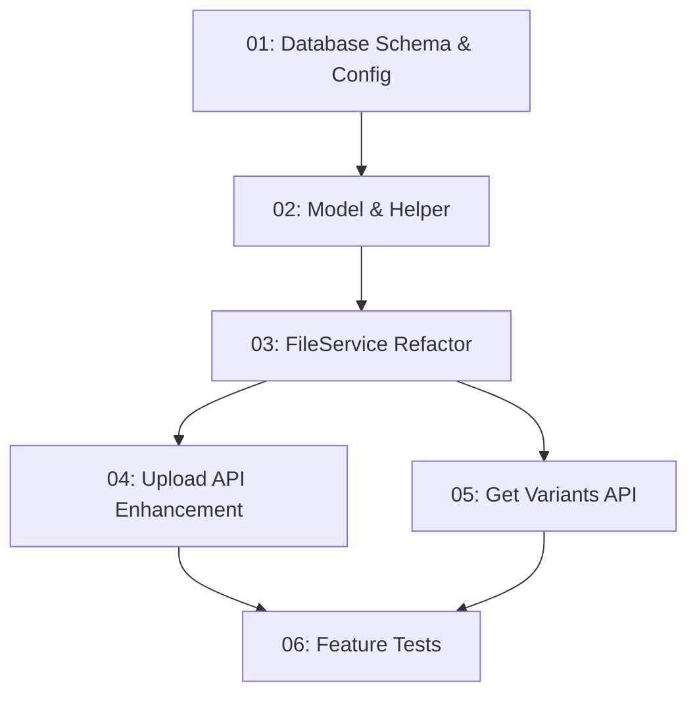

# Upload Ảnh Đa Kích Thước - Task Index

Master index cho toàn bộ tasks implement feature upload ảnh đa kích thước.

---

## Tổng quan

| Thuộc tính | Giá trị |
|---|---|
| **Requirement** | [01-upload-image.md](../requirements/01-upload-image.md) |
| **Ngày tạo** | 2026-05-06 |
| **Trạng thái** | 🟡 In Progress |
| **Tổng tasks** | 6 |

---

## Task Matrix

| ID | Task | Phase | Type | Skill | Workflow | Effort | Status | File |
|---|---|---|---|---|---|---|---|---|
| 01 | Database Schema & Config Update | 1 | IMPLEMENTATION | `bks-be-database-standard` | `/execute-database-task` | M | 🟡 Pending | [01-database-config.md](./2026-05-06-upload-image/01-database-config.md) |
| 02 | Image Model & FileHelper Update | 2b | IMPLEMENTATION | `bks-be-api-standard` | `/execute-api-task` | M | ⏳ Pending | [02-model-helper.md](./2026-05-06-upload-image/02-model-helper.md) |
| 03 | FileService Multi-Size Refactor | 2b | IMPLEMENTATION | `bks-be-api-standard` | `/execute-api-task` | L | ⏳ Pending | [03-fileservice-refactor.md](./2026-05-06-upload-image/03-fileservice-refactor.md) |
| 04 | Upload Image API Enhancement | 2b | IMPLEMENTATION | `bks-be-api-standard` | `/execute-api-task` | S | ⏳ Pending | [04-upload-api.md](./2026-05-06-upload-image/04-upload-api.md) |
| 05 | Get Image Variants Endpoint | 2b | IMPLEMENTATION | `bks-be-api-standard` | `/execute-api-task` | S | ⏳ Pending | [05-get-variants-api.md](./2026-05-06-upload-image/05-get-variants-api.md) |
| 06 | Upload Image Feature Tests | 4 | IMPLEMENTATION | `bks-be-testing-standard` | N/A | M | ⏳ Pending | [06-feature-tests.md](./2026-05-06-upload-image/06-feature-tests.md) |

---

## Dependency Graph

**Quy tắc dependency:**
- Task sau phải đợi task trước hoàn thành
- Các task cùng cấp có thể parallel (04 và 05)

---

## Business Rules

| Rule ID | Trạng thái | Mô tả |
|---|---|---|
| BR-G001 | ✅ Active | Chỉ user đã xác thực mới được upload |
| PROPOSED_BR:image-type-config-required | ⏳ Pending Review | Mọi upload phải kèm `type` tồn tại trong config |
| PROPOSED_BR:variant-naming-by-width | ⏳ Pending Review | Tên size variant phải nằm trong config |
| PROPOSED_BR:keep-original-file | ⏳ Pending Review | File gốc phải được giữ lại trên disk |
| PROPOSED_BR:responsive-srcset-helper | ⏳ Pending Review | `FileHelper` cung cấp method tạo `srcset` |

---

## Checklist Tổng thể

- [ ] Phase 1: Database & Config hoàn thành
- [ ] Phase 2: Backend API hoàn thành
- [ ] Phase 4: Testing hoàn thành
- [ ] Tất cả BR được review và cấp mã chính thức
- [ ] Feature tested và ready for integration

---

*Generated by pm-decompose-req-to-tasks workflow*
