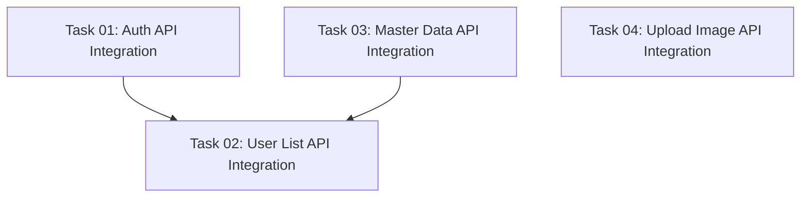

# Implementation Plan: Frontend API Integration

This document tracks the integration of all existing backend APIs into the frontend application.

## Progress Summary

- **Total Tasks**: 4
- **Completed**: 0 / 4 (0%)
- **Phase 1 (Foundation)**: ⏳ 0/0
- **Phase 2 (Backend API & Services)**: ⏳ 0/0
- **Phase 3 (Frontend)**: ⏳ 0/4
- **Phase 4 (Quality & Documentation)**: ⏳ 0/0
- **Estimated Total Effort**: M (4 tasks × ~3-5 hours)

## Task Modules

The implementation is divided into 4 modules across Phase 3 (Frontend).

### Phase 3: Frontend

| # | Task Module | Type | Effort | Link | Status |
| :--- | :--- | :--- | :--- | :--- | :--- |
| 01 | **Auth API Integration** | IMPL | M | [Task 01](./2026-05-12-fe-api-integration/01-auth-api-integration.md) | ⏳ Pending |
| 02 | **User List API Integration** | IMPL | S | [Task 02](./2026-05-12-fe-api-integration/02-user-list-api-integration.md) | ⏳ Pending |
| 03 | **Master Data API Integration** | IMPL | S | [Task 03](./2026-05-12-fe-api-integration/03-master-data-api-integration.md) | ⏳ Pending |
| 04 | **Upload Image API Integration** | IMPL | S | [Task 04](./2026-05-12-fe-api-integration/04-upload-image-api-integration.md) | ⏳ Pending |

## Dependency Graph

## Execution Order Recommendation

1. **Task 01: Auth API Integration** — Authentication is required for all protected routes.
2. **Task 03: Master Data API Integration** — Master data may be needed for user list filters.
3. **Task 02: User List API Integration** — Depends on Auth API for authorization.
4. **Task 04: Upload Image API Integration** — Can be done in parallel after Task 01.

## API Inventory

### Auth APIs (`/api/auth/*`)

| Method | Endpoint | Description | Auth |
|--------|----------|-------------|------|
| POST | `/api/auth/register` | User registration | No |
| POST | `/api/auth/login` | User login | No |
| POST | `/api/auth/logout` | User logout | Yes |
| GET | `/api/auth/me` | Get current user | Yes |
| POST | `/api/auth/profile` | Update profile | Yes |
| POST | `/api/auth/change-password` | Change password | Yes |

### User APIs (`/api/users`)

| Method | Endpoint | Description | Auth |
|--------|----------|-------------|------|
| GET | `/api/users` | List users with pagination/filter | Yes |

### Master Data APIs (`/api/master-data`)

| Method | Endpoint | Description | Auth |
|--------|----------|-------------|------|
| GET | `/api/master-data` | Get master data by resources | No |

### Upload APIs (`/api/upload-image`)

| Method | Endpoint | Description | Auth |
|--------|----------|-------------|------|
| POST | `/api/upload-image` | Upload image file | Yes |
