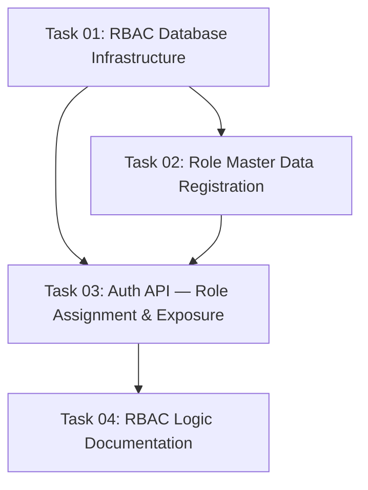

# Implementation Plan: RBAC Role-Based Authorization

This document tracks the high-level implementation of RBAC Role-Based Authorization based on the [02-role.md](../requirements/02-role.md).

## Progress Summary

- **Total Tasks**: 4
- **Completed**: 0 / 4 (0%)
- **Phase 1 (Foundation)**: ⏳ 0/2
- **Phase 2 (Backend API & Services)**: ⏳ 0/1
- **Phase 4 (Quality & Documentation)**: ⏳ 0/1
- **Estimated Total Effort**: 2M + 1S + 1S = ~3-4 days

Where status_icon = ✅ (all done) | 🔄 (in progress) | ⏳ (not started)

## Task Modules

The implementation is divided into 4 modules across 3 phases. Each module contains detailed tasks and dependencies.

### Phase 1: Foundation

| # | Task Module | Type | Effort | Link | Status |
| :--- | :--- | :--- | :--- | :--- | :--- |
| 1 | **RBAC Database Infrastructure** | IMPL | M | [Task 01](2026-05-12-role/task-01-database-infrastructure.md) | ⏳ Pending |
| 2 | **Role Master Data Registration** | IMPL | S | [Task 02](2026-05-12-role/task-02-master-data-registration.md) | ⏳ Pending |

### Phase 2: Backend API & Services

| # | Task Module | Type | Effort | Link | Status |
| :--- | :--- | :--- | :--- | :--- | :--- |
| 3 | **Auth API — Role Assignment & Exposure** | IMPL | M | [Task 03](2026-05-12-role/task-03-auth-api-role-assignment.md) | ⏳ Pending |

### Phase 4: Quality & Documentation

| # | Task Module | Type | Effort | Link | Status |
| :--- | :--- | :--- | :--- | :--- | :--- |
| 4 | **RBAC Logic Documentation** | DOC | S | [Task 04](2026-05-12-role/task-04-logic-documentation.md) | ⏳ Pending |

---

## Dependency Graph

## 🚦 Execution Order Recommendation

1. **Task 01: RBAC Database Infrastructure** — Foundation must be laid first. Install Spatie package, create enum, update model, create seeder.
2. **Task 02: Role Master Data Registration** — Can start immediately after Task 01. Simple enum driver registration.
3. **Task 03: Auth API — Role Assignment & Exposure** — Depends on both Task 01 (infrastructure) and Task 02 (master data). Modify AuthService and MeResource.
4. **Task 04: RBAC Logic Documentation** — Final documentation after all implementation is complete.

---

## Requirement Coverage Matrix

| Requirement Section | Flow | Covered By Task |
|---|---|---|
| §6.1 Role Storage Strategy | — | Task 01 |
| §6.2 UserRole Enum | — | Task 01 |
| §6.3 Default Role Assignment | Flow 1 | Task 01 (seeder), Task 03 (register) |
| §6.4 First Admin | Flow 5 | Task 01 |
| §7 Data Model Updates | — | Task 01 (Spatie tables) |
| Flow 1: Registration + Role | Flow 1 | Task 03 |
| Flow 2: RBAC Middleware Setup | Flow 2 | Task 01 (HasRoles trait) |
| Flow 3: GET /auth/me + role | Flow 3 | Task 03 |
| Flow 4: Master Data Role List | Flow 4 | Task 02 |
| Flow 5: Database Seeding | Flow 5 | Task 01 |
| PROPOSED_BR:default-member-role | — | Task 01, Task 03 |
| PROPOSED_BR:admin-full-access | — | Task 01 |
| PROPOSED_BR:member-read-only | — | Task 01 |
| PROPOSED_BR:role-api-exposure | — | Task 03 |
| PROPOSED_BR:role-master-data | — | Task 02 |
