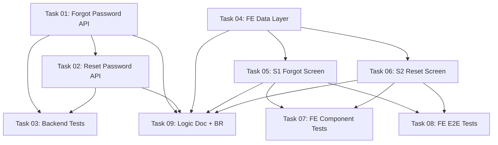

# Implementation Plan: Forgot / Reset Password

This document tracks the high-level implementation of the guest password-reset flow based on the [03-forgot-password.md](../requirements/03-forgot-password.md).

## Progress Summary

- **Total Tasks**: 9
- **Completed**: 9 / 9 (100%)
- **Backend track (Phase 2b API + Phase 4 tests)**: ✅ 3/3
- **Frontend track (Phase 3 — 3a Data / 3b Components / 3c Integration / 3d Tests)**: ✅ 5/5
- **Documentation track (Phase 4)**: ✅ 1/1
- **Estimated Total Effort**: 7M + 1S(04) + 1S(09) ≈ 3–4 days

> **No Phase 1 (Foundation)** — `password_reset_tokens` already exists, no migration/enum. **No Phase 2a (Jobs)** — both notifications are queued `Notification`s dispatched by HTTP requests, created inside the Phase 2b API tasks.
>
> **Task numbering = recommended execution order; the `phase` field = conceptual phase; the Dependency Graph is authoritative.** Backend tests (Task 03) are conceptually Phase 4 but depend only on Tasks 01–02 (never on frontend), so they are numbered right after the API tasks and run **in parallel with the whole frontend track**. Sections below are grouped by **build track**, not by phase number.

Where status_icon = ✅ (all done) | 🔄 (in progress) | ⏳ (not started)

## Task Modules

The implementation is divided into 9 modules across three build tracks; numbering follows recommended execution order.

### Backend track — API (Phase 2b) + tests (Phase 4)

| # | Task Module | Type | Phase | Effort | Link | Status |
| :--- | :--- | :--- | :--- | :--- | :--- | :--- |
| 1 | **Forgot Password API — Request Reset Link** | IMPL | 2b | M | [Task 01](2026-06-05-forgot-password/task-01-forgot-password-api.md) | ✅ Completed |
| 2 | **Reset Password API — Set New Password** | IMPL | 2b | M | [Task 02](2026-06-05-forgot-password/task-02-reset-password-api.md) | ✅ Completed |
| 3 | **Backend Tests — Non-Happy-Path & Security** | IMPL | 4 | M | [Task 03](2026-06-05-forgot-password/task-03-backend-tests.md) | ✅ Completed |

### Frontend track — Phase 3 (Screen × Layer)

Split by screen (S1 forgot, S2 reset) × layer. Every FE task is S/M effort — no L/XL.

| # | Task Module | Type | Phase | Effort | Link | Status |
| :--- | :--- | :--- | :--- | :--- | :--- | :--- |
| 4 | **FE Data Layer (S1+S2)** | IMPL | 3a | S | [Task 04](2026-06-05-forgot-password/task-04-fe-data-layer.md) | ✅ Completed |
| 5 | **S1 Forgot Password Screen** | IMPL | 3b/3c | M | [Task 05](2026-06-05-forgot-password/task-05-fe-forgot-screen.md) | ✅ Completed |
| 6 | **S2 Reset Password Screen** | IMPL | 3b/3c | M | [Task 06](2026-06-05-forgot-password/task-06-fe-reset-screen.md) | ✅ Completed |
| 7 | **FE Component/Unit Tests (Vitest)** | IMPL | 3d | M | [Task 07](2026-06-05-forgot-password/task-07-fe-component-tests.md) | ✅ Completed |
| 8 | **FE E2E Flow Tests (Playwright)** | IMPL | 3d | M | [Task 08](2026-06-05-forgot-password/task-08-fe-e2e-tests.md) | ✅ Completed |

### Documentation track — Phase 4

| # | Task Module | Type | Phase | Effort | Link | Status |
| :--- | :--- | :--- | :--- | :--- | :--- | :--- |
| 9 | **Logic Documentation + BR Registration** | DOC | 4 | S | [Task 09](2026-06-05-forgot-password/task-09-logic-documentation.md) | ✅ Completed |

**Status icons:** `⏳ Pending` · `🔄 In Progress` · `✅ Completed`

---

## Dependency Graph

No circular dependencies.

---

## 🚦 Execution Order Recommendation

Two independent tracks run in parallel; they converge only at documentation (Task 09).

**Backend track**
1. **Task 01: Forgot Password API** — defines the token-issuance contract.
2. **Task 02: Reset Password API** — depends on Task 01 (shared `AuthService` + token contract).
3. **Task 03: Backend Tests** — right after Tasks 01 & 02 (non-happy-path, security, concurrency).

**Frontend track (parallel with backend — mock-first via MSW)**
4. **Task 04: FE Data Layer** — unblocks both screens.
5. **Tasks 05 & 06 (S1, S2 screens)** — parallel once Task 04 is done.
6. **Tasks 07 & 08 (FE tests)** — after Tasks 05 & 06; parallel with each other.

**Converge**
7. **Task 09: Logic Doc + BR Registration** — last; documents the shipped behavior and promotes `PROPOSED_BR:*` → `BR-AUTH-*`.

---

## Requirement Coverage Matrix

| Requirement Section | Flow | Covered By Task |
|---|---|---|
| §8 Flow 1 — request link | Flow 1 | Task 01 |
| §8 Flow 2 — set password | Flow 2 | Task 02 |
| §6.1 Token strategy (hash, single-active, TTL) | — | Task 01 (issue), Task 02 (verify) |
| §6.2 No-enumeration | Flow 1 | Task 01; Task 03 (assert) |
| §6.3 Revoke sessions | Flow 2 | Task 02; Task 03 (assert) |
| §6.4 Rate-limit + cooldown | Flow 1 | Task 01; Task 03 (assert) |
| §10 ResetPasswordNotification | Flow 1 | Task 01 |
| §10 PasswordChangedNotification | Flow 2 | Task 02 |
| §11 API endpoints (2 guest) | Flow 1+2 | Task 01, Task 02 |
| §8 Error Cases (both flows) | Flow 1+2 | Task 03 |
| §9.4–9.5 FE data + Zod | — | Task 04 |
| §9.2 S1 (forgot) + §9.3/9.6/9.7 | — | Task 05 |
| §9.2 S2 (reset) + §9.3/9.6/9.7 | — | Task 06 |
| §9.8 i18n + Login link | — | Task 05 (link), Task 05/06 (keys) |
| FE component/unit tests | — | Task 07 |
| FE E2E flow tests | — | Task 08 |
| §5 Business Rules → BR registry | — | Task 09 |
| docs/logic/auth update | — | Task 09 |

### Business Rules (all `PROPOSED_BR:*` pending → `BR-AUTH-*` in Task 09)
`reset-token-hashed-at-rest`, `reset-token-ttl-60m`, `reset-token-single-use`, `reset-one-active-token-per-email`, `reset-email-no-enumeration`, `reset-revoke-all-sessions`, `reset-password-policy`, `reset-rate-limit`, `reset-new-password-must-differ`.

### Confirmed scope decisions (Phase V)
- **PasswordChangedNotification**: ✅ included (Task 02).
- **`reset-new-password-must-differ`**: ✅ enforced (Task 02 + Task 03).
- **Token TTL**: ✅ 60 minutes.
