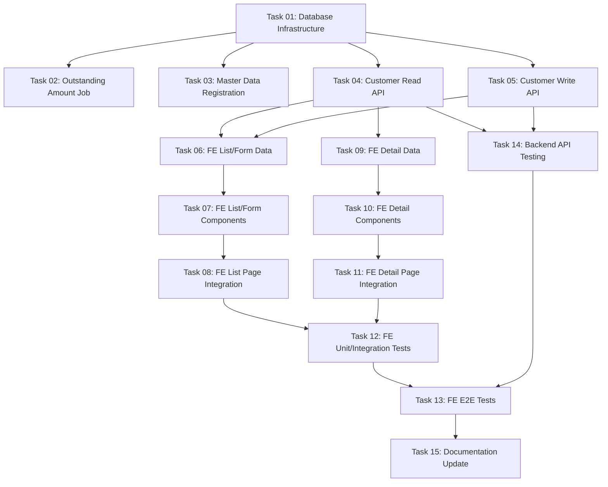

# Implementation Plan: Quản lý khách hàng

This document tracks the high-level implementation of Quản lý khách hàng based on the [01-customer-management.md](../requirements/01-customer-management.md).

## Progress Summary

- **Total Tasks**: 15
- **Completed**: 4 / 15 (27%)
- **Phase 1 (Foundation)**: ⏳ 0/1
- **Phase 2 (Backend API & Services)**: ⏳ 0/5 (Includes 2a Job, 2b APIs, and Phase 4 Backend Tests)
- **Phase 3 (Frontend)**: ⏳ 3/8
- **Phase 4 (Quality & Documentation)**: ⏳ 0/1

Where status_icon = ✅ (all done) | 🔄 (in progress) | ⏳ (not started)

## Task Modules

The implementation is divided into 15 modules. Sections are grouped by build track (Backend, Frontend, Documentation); numbering follows recommended execution order.

### Phase 1: Foundation

| # | Task Module | Type | Effort | Link | Status |
| :--- | :--- | :--- | :--- | :--- | :--- |
| 01 | **Database Infrastructure** | IMPL | S | [Task 01](2026-06-11-customer-management/task-01-database-infrastructure.md) | ⏳ Pending |

### Phase 2: Backend API & Services & Backend Tests

| # | Task Module | Type | Effort | Link | Status |
| :--- | :--- | :--- | :--- | :--- | :--- |
| 02 | **Outstanding Amount calculation Job** | IMPL | M | [Task 02](2026-06-11-customer-management/task-02-outstanding-amount-job.md) | ⏳ Pending |
| 03 | **Master Data Registration** | IMPL | S | [Task 03](2026-06-11-customer-management/task-03-master-data-registration.md) | ⏳ Pending |
| 04 | **Customer Read API** | IMPL | M | [Task 04](2026-06-11-customer-management/task-04-customer-read-api.md) | ⏳ Pending |
| 05 | **Customer Write API** | IMPL | M | [Task 05](2026-06-11-customer-management/task-05-customer-write-api.md) | ⏳ Pending |
| 14 | **Backend API Testing** | IMPL | S | [Task 14](2026-06-11-customer-management/task-14-backend-api-testing.md) | ⏳ Pending |

### Phase 3: Frontend

Split by **Screen × Layer** (3a Data / 3b Components / 3c Integration / 3d Tests). Every FE task must be S/M effort — no L/XL (see Frontend Task Decomposition Strategy).

| # | Task Module | Type | Effort | Link | Status |
| :--- | :--- | :--- | :--- | :--- | :--- |
| 06 | **3a — Customer List & Form Data Layer** | IMPL | S | [Task 06](2026-06-11-customer-management/task-06-fe-list-form-data.md) | ✅ Completed |
| 07 | **3b — Customer List & Form Components** | IMPL | M | [Task 07](2026-06-11-customer-management/task-07-fe-list-form-components.md) | ⏳ Pending |
| 08 | **3c — Customer List Page & Modal Integration** | IMPL | M | [Task 08](2026-06-11-customer-management/task-08-fe-list-page-integration.md) | ✅ Completed |
| 09 | **3a — Customer Detail Data Layer** | IMPL | S | [Task 09](2026-06-11-customer-management/task-09-fe-detail-data.md) | ✅ Completed |
| 10 | **3b — Customer Detail Components** | IMPL | M | [Task 10](2026-06-11-customer-management/task-10-fe-detail-components.md) | ✅ Completed |
| 11 | **3c — Customer Detail Page Integration** | IMPL | M | [Task 11](2026-06-11-customer-management/task-11-fe-detail-page-integration.md) | ⏳ Pending |
| 12 | **3d — Frontend Unit & Integration Tests** | IMPL | S | [Task 12](2026-06-11-customer-management/task-12-fe-unit-integration-tests.md) | ⏳ Pending |
| 13 | **3d — Frontend E2E Tests** | IMPL | S | [Task 13](2026-06-11-customer-management/task-13-fe-e2e-tests.md) | ⏳ Pending |

### Phase 4: Quality & Documentation

| # | Task Module | Type | Effort | Link | Status |
| :--- | :--- | :--- | :--- | :--- | :--- |
| 15 | **System Documentation Update** | DOC | S | [Task 15](2026-06-11-customer-management/task-15-documentation-update.md) | ⏳ Pending |

---

## Dependency Graph

## 🚦 Execution Order Recommendation

1. **Task 01: Database Infrastructure** — Creates migrations, models, enums. Must run first.
2. **Task 02: Outstanding Amount calculation Job** — Create the job that can be run in the background.
3. **Task 03: Master Data Registration** — Registers the enums so they are queryable.
4. **Task 04 & Task 05: Customer APIs** — Read/write API development (can run in parallel or sequence).
5. **Task 14: Backend API Testing** — Write test cases right after API implementation to secure BE logic.
6. **Task 06 to 08: Frontend List/Form Flow** — S1 / S3 implementation.
7. **Task 09 to 11: Frontend Detail Flow** — S2 implementation.
8. **Task 12 & Task 13: Frontend Tests** — Components/Hooks vitest followed by Playwright E2E tests.
9. **Task 15: Documentation Update** — Update indices and register BRs in the global registry.
