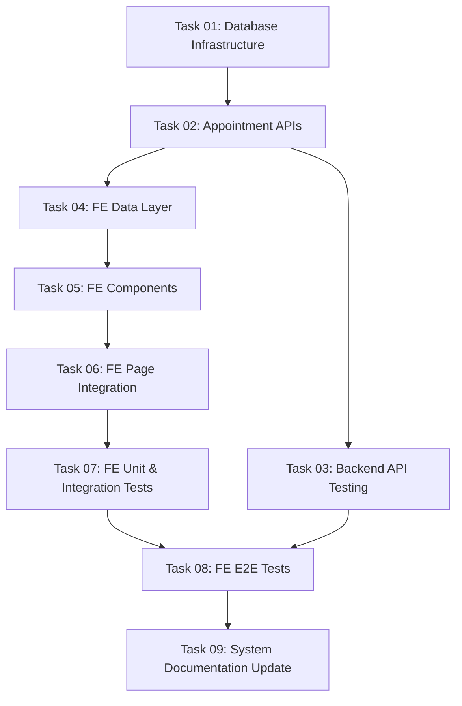

# Implementation Plan: Quản lý lịch hẹn

This document tracks the high-level implementation of Quản lý lịch hẹn based on the [03-appointment-management.md](../requirements/03-appointment-management.md).

## Progress Summary

- **Total Tasks**: 9
- **Completed**: 1 / 9 (11%)
- **Phase 1 (Foundation)**: ✅ 1/1
- **Phase 2 (Backend API & Services)**: ⏳ 0/1
- **Phase 3 (Frontend)**: ⏳ 0/5 (3a Data / 3b Components / 3c Integration / 3d Tests)
- **Phase 4 (Quality & Documentation)**: ⏳ 0/2 (Includes Backend Testing and Docs Update)

Where status_icon = ✅ (all done) | 🔄 (in progress) | ⏳ (not started)

## Task Modules

The implementation is divided into 9 modules. Sections are grouped by build track (Backend, Frontend, Documentation); numbering follows recommended execution order.

### Phase 1: Foundation

| # | Task Module | Type | Effort | Link | Status |
| :--- | :--- | :--- | :--- | :--- | :--- |
| 01 | **Database Infrastructure** | IMPL | S | [Task 01](2026-06-12-appointment-management/task-01-database-infrastructure.md) | ✅ Completed |

### Phase 2: Backend API & Services & Backend Tests

| # | Task Module | Type | Effort | Link | Status |
| :--- | :--- | :--- | :--- | :--- | :--- |
| 02 | **Appointment APIs** | IMPL | M | [Task 02](2026-06-12-appointment-management/task-02-appointment-apis.md) | ⏳ Pending |
| 03 | **Backend API Testing** | IMPL | S | [Task 03](2026-06-12-appointment-management/task-03-backend-api-testing.md) | ⏳ Pending |

### Phase 3: Frontend

Split by **Screen × Layer** (3a Data / 3b Components / 3c Integration / 3d Tests). Every FE task must be S/M effort — no L/XL (see Frontend Task Decomposition Strategy).

| # | Task Module | Type | Effort | Link | Status |
| :--- | :--- | :--- | :--- | :--- | :--- |
| 04 | **3a — Frontend Data Layer** | IMPL | S | [Task 04](2026-06-12-appointment-management/task-04-fe-data-layer.md) | ⏳ Pending |
| 05 | **3b — Frontend Components** | IMPL | M | [Task 05](2026-06-12-appointment-management/task-05-fe-components.md) | ⏳ Pending |
| 06 | **3c — Frontend Page Integration** | IMPL | M | [Task 06](2026-06-12-appointment-management/task-06-fe-page-integration.md) | ⏳ Pending |
| 07 | **3d — Frontend Unit & Integration Tests** | IMPL | S | [Task 07](2026-06-12-appointment-management/task-07-fe-unit-integration-tests.md) | ⏳ Pending |
| 08 | **3d — Frontend E2E Tests** | IMPL | S | [Task 08](2026-06-12-appointment-management/task-08-fe-e2e-tests.md) | ⏳ Pending |

### Phase 4: Quality & Documentation

| # | Task Module | Type | Effort | Link | Status |
| :--- | :--- | :--- | :--- | :--- | :--- |
| 09 | **System Documentation Update** | DOC | S | [Task 09](2026-06-12-appointment-management/task-09-documentation-update.md) | ⏳ Pending |

---

## Dependency Graph

## 🚦 Execution Order Recommendation

1. **Task 01: Database Infrastructure** — Creates migrations, models, enums. Must run first.
2. **Task 02: Appointment APIs** — Read/write CRUD API development.
3. **Task 03: Backend API Testing** — Write test cases right after API implementation to secure BE logic.
4. **Task 04 to 06: Frontend Flow** — Interfaces, repositories, hooks, components, and page integration.
5. **Task 07 & Task 08: Frontend Tests** — Components/Hooks vitest followed by Playwright E2E tests.
6. **Task 09: System Documentation Update** — Update indices and register BRs in the global registry.
