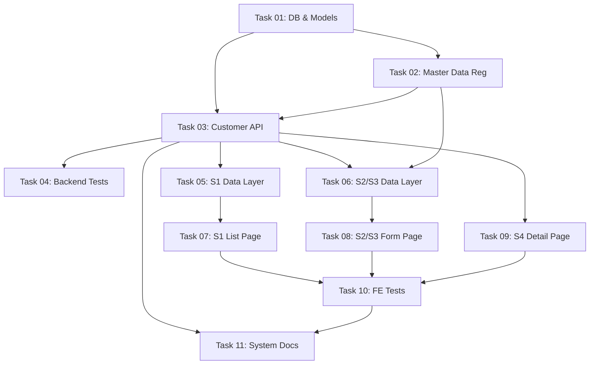

# Implementation Plan: Quản lý khách hàng

Tài liệu này theo dõi quá trình thực hiện tính năng Quản lý khách hàng / bệnh nhân tại phòng khám da liễu May Skinlab dựa trên tài liệu đặc tả yêu cầu [01-customer-management.md](../requirements/01-customer-management.md).

---

## Progress Summary

- **Total Tasks**: 11
- **Completed**: 9 / 11 (81%)
- **Phase 1 (Foundation)**: ✅ 2/2
- **Phase 2 (Backend API & Services)**: ⏳ 0/1
- **Phase 3 (Frontend)**: ✅ 6/6
- **Phase 4 (Quality & Documentation)**: ⏳ 1/2
- **Estimated Total Effort**: 10 M (Medium) & 2 S (Small) = 12 tasks total (excluding documentation/coordination)

---

## Task Modules

Danh sách các nhiệm vụ phát triển được phân chia theo luồng công việc (Backend, Frontend, và Tài liệu) kèm theo thứ tự thực thi đề xuất.

### Phase 1: Foundation (Cơ sở dữ liệu & Cấu hình)

| # | Task Module | Type | Effort | Link | Status |
| :- | :--- | :--- | :--- | :--- | :--- |
| 01 | **Database Infrastructure & Models** | IMPL | M | [Task 01](./2026-06-14-customer-management/task-01-database-infrastructure.md) | ✅ Completed |
| 02 | **Master Data Registration** | IMPL | S | [Task 02](./2026-06-14-customer-management/task-02-master-data-registration.md) | ✅ Completed |

### Phase 2: Backend API & Services

| # | Task Module | Type | Effort | Link | Status |
| :- | :--- | :--- | :--- | :--- | :--- |
| 03 | **Customer API (CRUD & Services)** | IMPL | M | [Task 03](./2026-06-14-customer-management/task-03-customer-api.md) | ⏳ Pending |

### Phase 3: Frontend (Next.js 16)

Phân chia chi tiết theo Screen × Layer:

| # | Task Module | Type | Effort | Link | Status |
| :- | :--- | :--- | :--- | :--- | :--- |
| 05 | **3a — Screen S1 (Customer List) Data Layer** | IMPL | S | [Task 05](./2026-06-14-customer-management/task-05-customer-list-data-layer.md) | ✅ Completed |
| 06 | **3a — Screen S2 & S3 (Customer Form) Data Layer** | IMPL | S | [Task 06](./2026-06-14-customer-management/task-06-customer-form-data-layer.md) | ✅ Completed |
| 07 | **3c — Screen S1 (Customer List) Page & Components** | IMPL | M | [Task 07](./2026-06-14-customer-management/task-07-customer-list-page.md) | ✅ Completed |
| 08 | **3c — Screen S2 & S3 (Customer Form) Page & Components** | IMPL | M | [Task 08](./2026-06-14-customer-management/task-08-customer-form-page.md) | ✅ Completed |
| 09 | **3c — Screen S4 (Customer Detail) Page & Components** | IMPL | M | [Task 09](./2026-06-14-customer-management/task-09-customer-detail-page.md) | ✅ Completed |
| 10 | **3d — Frontend Test Cases (Vitest & Playwright)** | IMPL | M | [Task 10](./2026-06-14-customer-management/task-10-frontend-tests.md) | ✅ Completed |

### Phase 4: Quality & Documentation (Chất lượng & Tài liệu)

| # | Task Module | Type | Effort | Link | Status |
| :- | :--- | :--- | :--- | :--- | :--- |
| 04 | **Backend Test Suite (PHPUnit)** | IMPL | S | [Task 04](./2026-06-14-customer-management/task-04-backend-test-suite.md) | ⏳ Pending |
| 11 | **System Logic & API Documentation** | DOC | S | [Task 11](./2026-06-14-customer-management/task-11-system-logic-documentation.md) | ✅ Completed |

---

## Dependency Graph

---

## 🚦 Execution Order Recommendation

1. **Task 01: Database Infrastructure & Models** — Bắt buộc làm trước tiên để tạo cột và các bảng địa phương mới.
2. **Task 02: Master Data Registration** — Đăng ký Master Data cho địa chỉ trước khi tích hợp vào API.
3. **Task 03: Customer API** — Xây dựng logic service và các endpoint phục vụ Frontend.
4. **Task 04: Backend Test Suite** — Kiểm thử Backend ngay sau khi API hoàn thành, chạy song song với luồng Frontend.
5. **Tasks 05, 06**: Khởi tạo Data Layer (Type, Schema Zod, Repository) cho danh sách và form.
6. **Tasks 07, 08, 09**: Xây dựng UI và tích hợp page (Danh sách, Form tạo/sửa, Chi tiết).
7. **Task 10**: Viết các kịch bản kiểm thử tích hợp (Vitest) và E2E (Playwright).
8. **Task 11**: Hoàn thiện các tài liệu logic hệ thống và cập nhật registry rule.
