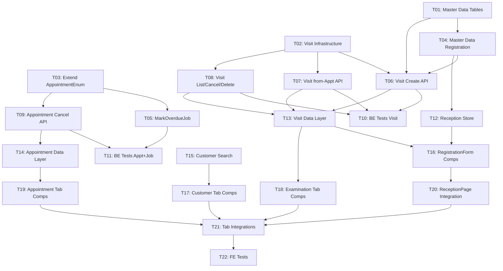

# Implementation Plan: Quản Lý Tiếp Nhận — Reception Management

This document tracks the high-level implementation of the Reception Management module based on the [reception-management.md](../requirements/skinlab/reception-management.md).

---

## Progress Summary

- **Total Tasks**: 22
- **Completed**: 0 / 22 (0%)
- **Phase 1 (Foundation)**: ⏳ 0/4
- **Phase 2a (Background Jobs)**: ⏳ 0/1
- **Phase 2b (Backend API)**: ⏳ 0/4
- **Phase 3 (Frontend — 3a Data / 3b Components / 3c Integration / 3d Tests)**: ⏳ 0/11
- **Phase 4 (Quality — BE Tests)**: ⏳ 0/2
- **Estimated Total Effort**: 4×S + 12×M + 1×L ≈ 15–20 ngày làm việc

---

## Task Modules

The implementation is divided into 22 modules. Sections are grouped by build track (Backend, Frontend); numbering follows recommended execution order.

### Phase 1: Foundation

| # | Task Module | Type | Effort | Link | Status |
| :--- | :--- | :--- | :--- | :--- | :--- |
| 01 | **Database: Master Data Tables** (`clinic_rooms`, `services`, `service_packages`) | IMPL | M | [Task 01](2026-06-15-reception-management/01-database-master-data-tables.md) | ⏳ Pending |
| 02 | **Database: Visit Infrastructure** (`visits`, `visit_services`, `visit_packages`, enums) | IMPL | L | [Task 02](2026-06-15-reception-management/02-database-visit-infrastructure.md) | ⏳ Pending |
| 03 | **Database: Extend AppointmentStatusEnum** (thêm OVERDUE=7) | IMPL | S | [Task 03](2026-06-15-reception-management/03-database-appointment-enum-extend.md) | ⏳ Pending |
| 04 | **Master Data Registration** (`clinic_rooms`, `services`, `service_packages`) | IMPL | S | [Task 04](2026-06-15-reception-management/04-master-data-registration.md) | ⏳ Pending |

### Phase 2: Backend API & Services

| # | Task Module | Type | Effort | Link | Status |
| :--- | :--- | :--- | :--- | :--- | :--- |
| 05 | **Job: MarkOverdueAppointmentsJob** | IMPL | S | [Task 05](2026-06-15-reception-management/05-job-mark-overdue-appointments.md) | ⏳ Pending |
| 06 | **Visit API: Create** (`POST /api/v1/visits` — walk-in + scheduled) | IMPL | M | [Task 06](2026-06-15-reception-management/06-api-visit-create.md) | ⏳ Pending |
| 07 | **Visit API: From Appointment** (`POST /api/v1/visits/from-appointment`) | IMPL | M | [Task 07](2026-06-15-reception-management/07-api-visit-from-appointment.md) | ⏳ Pending |
| 08 | **Visit API: List + Cancel + Delete** (`GET`, `PATCH cancel`, `DELETE`) | IMPL | M | [Task 08](2026-06-15-reception-management/08-api-visit-list-cancel-delete.md) | ⏳ Pending |
| 09 | **Appointment API: Cancel** (`PATCH /api/v1/appointments/{id}/cancel`) | IMPL | S | [Task 09](2026-06-15-reception-management/09-api-appointment-cancel.md) | ⏳ Pending |
| 10 | **BE Tests: Visit CRUD** — non-happy paths (Phase 4) | IMPL | M | [Task 10](2026-06-15-reception-management/10-be-tests-visit.md) | ⏳ Pending |
| 11 | **BE Tests: Appointment Cancel + MarkOverdue Job** (Phase 4) | IMPL | S | [Task 11](2026-06-15-reception-management/11-be-tests-appointment-job.md) | ⏳ Pending |

### Phase 3: Frontend

Split by **Screen × Layer** (3a Data / 3b Components / 3c Integration / 3d Tests). Every FE task is S/M effort.

| # | Task Module | Type | Effort | Link | Status |
| :--- | :--- | :--- | :--- | :--- | :--- |
| 12 | **3a — Reception Store + Master Data Hook** | IMPL | S | [Task 12](2026-06-15-reception-management/12-fe-3a-reception-store-master-data.md) | ⏳ Pending |
| 13 | **3a — Visit Data Layer** (types, Zod, repository, hooks) | IMPL | M | [Task 13](2026-06-15-reception-management/13-fe-3a-visit-data-layer.md) | ⏳ Pending |
| 14 | **3a — Appointment Data Layer** (types, repository, hooks) | IMPL | S | [Task 14](2026-06-15-reception-management/14-fe-3a-appointment-data-layer.md) | ⏳ Pending |
| 15 | **3a — Customer Search Data Layer** (`useSearchCustomers`) | IMPL | S | [Task 15](2026-06-15-reception-management/15-fe-3a-customer-search.md) | ⏳ Pending |
| 16 | **3b — S1 RegistrationForm Components** (7 components) | IMPL | M | [Task 16](2026-06-15-reception-management/16-fe-3b-registration-form-components.md) | ⏳ Pending |
| 17 | **3b — S2 Customer Tab + S5 Modal Components** | IMPL | S | [Task 17](2026-06-15-reception-management/17-fe-3b-customer-tab-components.md) | ⏳ Pending |
| 18 | **3b — S3 Examination Tab + S6+S7 Dialog Components** | IMPL | M | [Task 18](2026-06-15-reception-management/18-fe-3b-examination-tab-components.md) | ⏳ Pending |
| 19 | **3b — S4 Appointment Tab + S8 Dialog + S9 Drawer Components** | IMPL | M | [Task 19](2026-06-15-reception-management/19-fe-3b-appointment-tab-components.md) | ⏳ Pending |
| 20 | **3c — ReceptionPage Layout Integration** (S1 + tabs wiring) | IMPL | M | [Task 20](2026-06-15-reception-management/20-fe-3c-reception-page-integration.md) | ⏳ Pending |
| 21 | **3c — Tab Integrations** (S2 + S3 + S4 full flow + URL state) | IMPL | M | [Task 21](2026-06-15-reception-management/21-fe-3c-tab-integrations.md) | ⏳ Pending |
| 22 | **3d — FE Tests** (Vitest + Playwright) | IMPL | M | [Task 22](2026-06-15-reception-management/22-fe-3d-tests.md) | ⏳ Pending |

---

## Dependency Graph

---

## 🚦 Execution Order Recommendation

1. **T01, T02, T03** — Chạy song song (DB migrations độc lập)
2. **T04** — Sau T01 (Master Data Registration cần bảng sẵn)
3. **T05** — Sau T03 (Job cần OVERDUE enum)
4. **T06, T07, T08** — Sau T01+T02+T04 (Visit APIs)
5. **T09** — Sau T03 (Appointment Cancel API)
6. **T10** — Sau T06+T07+T08 (BE Tests Visit, chạy song song với FE)
7. **T11** — Sau T05+T09 (BE Tests Appt+Job, chạy song song với FE)
8. **T12** — Sau T04 (Reception Store + Master Data Hook)
9. **T13, T14, T15** — Song song (FE Data layers)
10. **T16, T17, T18, T19** — Song song (FE Components, sau data layers liên quan)
11. **T20** — Sau T16 (ReceptionPage layout)
12. **T21** — Sau T17+T18+T19+T20 (Tab integrations)
13. **T22** — Sau T21 (FE Tests)
